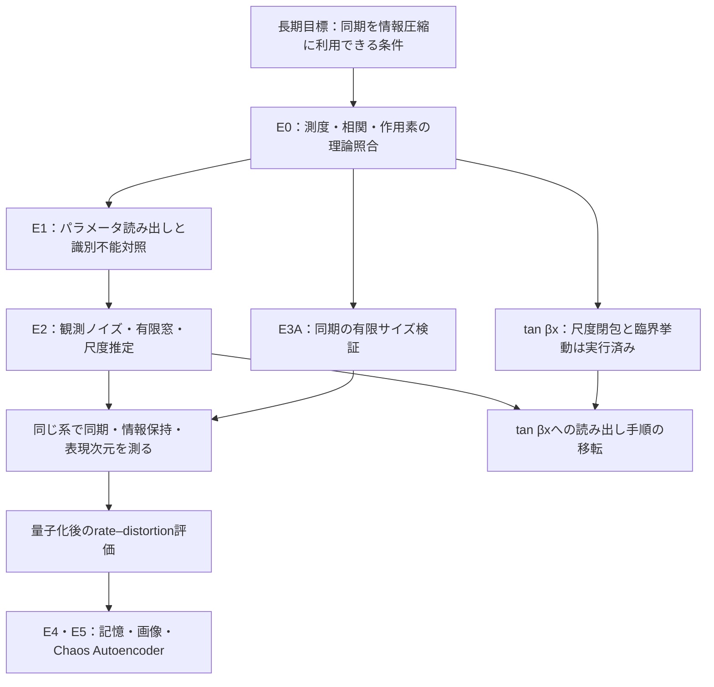

# 可解カオスの軌道読み出し・Cauchy潜在・同期VAE：研究・実験ノート

**2026-09-07改訂：研究の次段階をCauchy潜在とカオス同期VAEの構築・反証実験へ拡張する。**
既存の結果を保存し、現行の研究目的・実験計画は第15章を正本とする。
以下の2026-09-06時点の記述は履歴であり、今回の追加実験は第15章とE6のrunを参照する。

整理日：2026年9月6日。対象：一般化Boole変換、TM型座標、tangent写像、同期、有限時間復号。

本書は、研究目的・理論・既存結果・次の実験をつなぐ作業用テキストである。実験を新たに実行した報告ではない。既存runのREADME、主要metrics、特徴抽出コード、卒論TeXを照合して整理した。既存runの全予測・ハッシュ・validatorを今回再実行したわけではなく、検証件数は保存記録による。

添付の議論は構成の出発点として使用した。Research Advisory Noteそのものと添付で言及された全論文を直接読んだ扱いにはしない。先生の見解としての引用と、以下の数式から導く判断を区別する。

## 読み方

- 全体像をつかむ：第1〜3章。
- 理論を学びながら式を追う：第4〜9章。
- 実験を始める：第10〜12章。最初はE2Aの観測ノイズだけを変える。
- 発表・卒論を書く：第13〜14章。数値は出典のrunと対にして使う。

表記は **【理論】**＝明示した仮定の下の導出、**【観測】**＝指定条件の保存済み結果、**【仮説】**＝これから検証する予測、**【未確認】**＝必要な証拠が不足、を用いる。「採用」は条件付き研究主張の採用であり、普遍的優位や実用化の認定ではない。

## 1. 研究目標を三段階に分ける

### 1.1 長期目標

> 神経系に見られる動的同期に着想を得て、カオス同期が冗長自由度を減らすとき、必要な入力情報を残し、有限精度で復号できる条件を明らかにする。

到達候補はChaos Autoencoderである。ただし、今の研究を「画像AEを完成させる」という一つの成功条件へ押し込まない。脳の省エネルギーや記憶がカオス同期に由来するという主張、通常AEより速い・省電力という主張は本研究の前提にしない。

### 1.2 当面の主問題

> Cauchy構造を持つ力学系について、観測写像・有限時間・測度に適合した座標が、生成パラメータや入力の識別可能性と復号誤差をどう決めるか。

「TMの方が必ず高精度」を目的にしない。どの条件で有効か、なぜ有効か、どの条件では原理的に不可能かを示す。この立て方なら、識別不能例やFourierが勝つ条件も主問題への回答になる。

### 1.3 卒論としての達成条件

1. 単一写像で、測度・相関・作用素の理論と数値実装を対応させる。
2. 有限観測の読み出しについて、容量・分割・尺度推定・比較対象を明示する。
3. 観測が情報を捨てる反例と、ノイズによる実用上の復号限界を示す。
4. 同期と読み出しの別々の実験を、同じ入力・同じ観測・同じ結合走査で評価する最小モデルへ接続する。
5. 圧縮まで主張する場合だけ、量子化後符号長と復号歪みを測る。

既存運用の最小スコープE0〜E3を維持する。E4＝連想記憶、E5＝画像・AE/VAE拡張であり、現時点で完了済みとしない。

## 2. 研究の流れと混同しない四つの課題

以下は目的変数も分割も異なる。結果を相互に代用しない。

| 課題 | 固定するもの | 変えるもの／目的変数 | 成功の意味 |
|---|---|---|---|
| 系同定 | 観測手順 | 写像パラメータα・β | 軌道統計から生成則を推定できる |
| 初期入力の記憶 | 写像パラメータ | 入力u、初期条件E(u) | 待機後にも同じ系の入力差を読める |
| 未来予測 | 写像と辞書 | 予測時間h、未来観測 | 現在の有限辞書で未来観測を表せる |
| 圧縮・復号 | 符号化・量子化・復号規約 | 符号長Rと入力歪みD | 限られたbit数で必要情報を復元できる |

既存E1A/Bは主に**系同定**である。αを軌道ごとに変えるので、入力によって生成則が変わり続ける。これは固定写像に一度だけ与えた初期入力が長期記憶されることの証拠ではない。4096点を16特徴へ要約できても、元の4096点を復元したことにはならない。

## 3. 現在地：実験結果と主張の対応

### 3.1 照合できたローカル実験

出典記号は第14章のrunへ対応する。差の符号は必ず明記する。

| 実験 | 条件と主要結果 | 採用できる解釈 | まだ言えないこと |
|---|---|---|---|
| E0 Boole [R0] | α=0.4,0.5,0.6、各5 seed、各10万点。事前ゲート・記録上の独立37項目通過 | 単一非結合写像の理論整合性 | 結合系の閉包、圧縮有用性 |
| E1A独立追試 [R1] | 48 test seed。TM RMSE 0.002096、Fourier 0.002356。Fourier−TMの95%区間 [−0.000023,0.000561] | 時間構造の有効性。TM優位ゲートは未達 | 点推定だけによる優位宣言 |
| E1A容量一致 [R2] | 新規48 test seed。両者16次元。選択TM 0.001342、Fourier 0.002614。Fourier−TM区間 [0.000985,0.001560] | この選択手順・固定Fourier帯域に対する改善 | 全Fourier方式に対する優位 |
| E1B 2源 [R3] | oracle TM 0.002083、direct TM 0.007740。対称1観測で352衝突対の特徴差0。下限0.073030に対しTM 0.073710 | 可逆観測の正対照と、源順序の識別不能境界 | blind source separation、入力波形復元 |
| E3A pilot [R4] | 792条件。最大N/local、一様正結合K50=0.4875、区間 [0.475,0.525] | pilotで理論閾値付近の持続凝集を観察 | 全結合分布の普遍性 |
| E3A確認 [R5] | 800条件、10 seed、N最大512。K50=0.465625、区間 [0.4625,0.475]。事前許容0.5±0.05内 | 既定の有限サイズ・持続同期規則の確認基準を満たす | 95%区間が理論値0.5を含む、熱力学極限を証明した |
| E0 tan(βx) [R6] | float64一段閉包DKW 209/210通過。非有限run 0。β>1の12条件でLyapunov理論値がseed区間内 | 中心Cauchy閉包の導出と有限時間統計の対応 | 全ゲート合格、全初期値のエルゴード性 |
| E0 TM理論照合 [R7] | 80/80照合。Gram最大誤差1.60424×10⁻¹⁵、Boole相関求積最大1.11023×10⁻¹⁶、16 seedの平均相関最大誤差0.00434475 | 測度適合・対角相関・整数倍写像の有限射影理論との整合 | 新しい読み出し精度比較、収束率の証明 |

容量一致E1Aは、fit 5α×28 seed、test未使用補間4α×48 seed、burn-in 2048、観測4096。TM候補4組とridgeをfit内4-fold grouped CVで選んだ。Fourier側の帯域定義は固定なので選択予算は非対称である。選択TM16次元と全TM80次元のRMSE差が小さいことも、最小十分統計量を発見した証明ではない。[R2]

E1Bは既知A、混合前の源別標準化という理想化条件を使う。観測チャネルだけを渡される実データで、この前処理をそのまま実施できるとは限らない。[R3]

### 3.2 不一致・失敗を保持する

tan(βx)の不通過はβ=1、初期尺度1の1標本集合で、KS=0.0073901139、閾値0.0072956922だった。同一標本を100桁で再計算してもKSは同じで、CDF最大差は7.07×10⁻¹⁷。数値誤差で説明できたとはしない。有限標本の不一致を記録したまま、解析的な密度変換の証明と分ける。[R6]

float32、β=1.01のLyapunov推定0.3542450は理論0.3267965からずれた。主計算はfloat64とするが、float64も数学的な無限精度ではない。極近傍・大引数・反復状態の監査を残す。β=1.0001のfloat64有限軌道でもKS距離のseed平均は約0.156であり、Lyapunov区間の整合だけで有限時間の分布全体が十分収束したとは言わない。[R6 metrics]

### 3.3 卒論草稿にある別系列を合算しない

[卒論TeX](../../../latex/thesis/main.tex)には、提供草稿Draft v0.1由来の**別系列**として、固定TM−実数時系列FourierのRMSE差0.003114、95%区間 [0.002064,0.004116]、48 seed中42 seedでFourierが良いという転記がある。これは[R2]とは特徴・選択・比較対象が異なる。TeX自体も一次コード・個別予測等の未確認を明記している。

したがって、[R2]を取り消したり、都合のよい系列だけを残したりしない。ローカルrunで確認した結果と、草稿に転記された未再検証の結果を分ける。別系列の完全な設定・データ・予測が取得できたら、同条件比較の表へ追加する。草稿のTM-Aにある未来予測の数値も同じ扱いであり、今回の80照合がその学習実験の再現を保証するわけではない。

## 4. 理論の出発点：分布の縮約と軌道情報

### 4.1 共通記号

| 記号 | 意味 |
|---|---|
| u | 復号したい有限次元入力またはクラス |
| xₜ、sₜ、yₜ | 力学状態、源状態、観測 |
| α | Booleパラメータ、0<α<1 |
| β | Fβ(x)=tan(βx)の係数、β>0 |
| γ、η | Cauchy真尺度、特徴計算に使う参照尺度 |
| m | 整数倍tangent写像の倍率 |
| g | 新規実験で使う結合強度。既存E3のKと同種の量 |
| L、k | 辞書最大次数、個々のモード次数 |
| T、τ、h、w | 観測長、遅延、予測先、入力後の待機時間 |
| z、d_z | 読み出し特徴、実数座標としての次元 |

既存資料のKは結合強度・写像倍率・辞書次数の三つに使われるため、本書では区別する。既存runのconfig名は改名しない。

### 4.2 Cauchy分布で何が定義できるか

中心0、尺度γ>0の密度と分布関数は

\[
\rho_\gamma(x)=\frac{\gamma}{\pi(x^2+\gamma^2)},\qquad
H_\gamma(x)=\frac12+\frac1\pi\arctan(x/\gamma).
\]

中央値0、四分位点±γなので、経験尺度として半四分位幅を使える。一方、通常の平均・分散は存在しない。生の状態の標本分散は計算できても、有限の母分散の推定とは解釈しない。分布比較はCDF、KS距離、分位点、裾確率、有界観測を中心にする。

【理論】独立な中心Cauchy変数Xⱼの線形和は、特性関数から

\[
\varphi_{\sum a_jX_j}(t)=\prod_j e^{-|a_j|\gamma_j|t|}
=e^{-\sum_j|a_j|\gamma_j|t|}
\]

となり、尺度Σ|aⱼ|γⱼのCauchy分布になる。ただし、結合して依存した変数について独立積を使うことはできない。相関するCauchy変数一般に「周辺がCauchyだから同じ閉包」とは言えない。

### 4.3 尺度一つで記述できることの限界

密度の族ρ(x;γ)が不変でも、γは個々の状態列を特定しない。同じγを持つ無数の標本・軌道がある。したがって

\[
\text{分布族の有限パラメータ閉包}
\not\Rightarrow\text{個々の入力の可逆符号化}.
\]

同じ固定写像でエルゴード性が成立し、入力が初期条件だけを変え、観測fが可積分なら、ほとんどの初期条件の長時間平均は∫f dμへ近づく。このとき長時間平均だけに保存した初期条件差は消える。一方、αが入力ごとに違えば時間相関の極限自体が違いうる。これが「初期値記憶」と「系同定」を分ける理由である。

## 5. 一般化Boole変換を基準系にする

### 5.1 尺度閉包と不変測度

\[
F_\alpha(x)=\alpha(x-x^{-1}),\qquad 0<\alpha<1.
\]

x=0と、そこへ有限回で到達する特異点の逆像を除く。中心Cauchy族の押し出しは

\[
\gamma_{t+1}=\alpha(\gamma_t+\gamma_t^{-1})
\]

で、正の固定点は

\[
\gamma_*^2=\frac{\alpha}{1-\alpha}.
\]

一般式a x−b/x（a,b>0）なら尺度更新aγ+b/γ、不変尺度√(b/(1−a))である。二つの記法のbをαと取り違えない。

【既知理論】この領域の不変Cauchy測度とLyapunov指数は一般化Boole変換の原著に対応する。原著のパラメータ表記と上式のb=αを対応させて使う。[Umeno・Okubo, 2016](https://doi.org/10.1093/ptep/ptv195)

\[
\lambda_\alpha=\int\log|F'_\alpha(x)|\rho_{\gamma_*}(x)dx
=2\log(\sqrt\alpha+\sqrt{1-\alpha}).
\]

α=1/2でλ=log2。これは基準値であり、正のλだけで復号性能は決まらない。

### 5.2 標準化後にも残る生成則

v=x/γ*とすると

\[
v_{t+1}=G_\alpha(v_t)=\alpha v_t-\frac{1-\alpha}{v_t}.
\]

定常周辺分布はすべて尺度1のCauchyになる。しかし写像Gαはαに依存するので、同時分布・時間相関にはα情報が残る。

実験では真のγ*(α)を未知αの推定器へ与えない。既存E1は軌道ごとの中央値と半四分位幅で標準化する。これは観測だけで計算できる一方、有限窓の推定誤差も含む。oracle尺度による理論照合と区別する。

## 6. TM型座標は何を保証するか

### 6.1 測度に適合した有界座標

\[
q_\gamma(x)=\frac{x-i\gamma}{x+i\gamma},\quad
M_k(x)=q_\gamma(x)^k,\quad k\in\mathbb Z.
\]

実数xで|q|=1。x=γtanθとおくと

\[
d\mu_\gamma=\frac{d\theta}{\pi},\qquad q_\gamma=-e^{2i\theta}.
\]

よって

\[
\langle M_k,M_\ell\rangle_{\mu_\gamma}
=\frac{(-1)^{k-\ell}}\pi\int_{-\pi/2}^{\pi/2}
e^{2i(k-\ell)\theta}d\theta=\delta_{k\ell}.
\]

全整数次数なら重み付きL²(μγ)で完全な直交系になる。正次数の実部・虚部と定数を使えば実数値観測を表せる。本書は共通極に対応する**TM型／Cayley冪座標**を扱い、任意の極列を最適化する一般TM系すべての結果とはしない。

Lebesgue測度L²(dx)上の有理系へ対応させるには、例えば

\[
\psi_k(x)=\sqrt{\gamma/\pi}\,(x+i\gamma)^{-1}q_\gamma(x)^k
\]

という重みが必要である。qᵏだけがL²(dx)上でもそのまま直交すると書かない。

### 6.2 Fourierとの関係

Cayley角度上のFourierとqᵏは位相規約を除いて同じ座標である。「TM対Fourier」を比較するときは次の三つを区別する。

1. Cayley角度のFourier：TM型座標と同値。実装等価性の対照。
2. 生の実数状態を引数にしたsin/cos辞書：測度・周波数選択が異なる。
3. 時間方向のFourierスペクトル：時間列の周波数情報を要約する。

既存[R2]のFourierはCayley値の実部・虚部それぞれの時間スペクトルを8帯域ずつ要約した対数パワー16次元である。生の状態の時間Fourierや、角度Fourierそのものとは違う。線形の直交回転・同じ正規化・同じ等方ridgeまで一致した同値座標なら、名前だけで予測優位は生じない。

### 6.3 少数モードで近似できる条件

f∈L²(μγ)、cₖ=⟨f,Mₖ⟩として

\[
P_Lf=\sum_{|k|\le L}c_kM_k,\qquad
\|f-P_Lf\|^2=\sum_{|k|>L}|c_k|^2.
\]

直交射影なので、この辞書の線形結合内では最良近似である。ただし低次元で誤差が小さいには高次係数のエネルギーが小さい必要がある。Cauchy分布というだけでその減衰は保証されない。特にf(x)=xはL²(μγ)に属さず、この保証を生の軌道MSEへ適用できない。[理論整理・数値照合：R7、卒論TeX]

### 6.4 尺度ずれとノイズ

真尺度γに参照尺度ηを使うと

\[
\mathbb E_{\mu_\gamma}q_\eta(X)=\frac{\gamma-\eta}{\gamma+\eta}.
\]

尺度ずれだけで非零の瞬時平均が生じる。したがって有限窓の瞬時特徴が少し予測できても、時間情報を回収した証拠にはならない。

また

\[
\left|\frac{dM_k}{dx}\right|=\frac{2|k|\gamma}{x^2+\gamma^2}
\le\frac{2|k|}{\gamma},\quad
|M_k(x+\delta)-M_k(x)|\le\min(2,2|k||\delta|/\gamma).
\]

低次数はノイズ感度を抑えやすいが、γが小さい臨界近傍では同じ絶対ノイズへの感度が増す。有界特徴であっても、復号器Wのノルムが大きければ出力誤差は増幅する。固定尺度の上界と、ノイズ後に尺度を再推定する実験を分ける。

## 7. 時間遅延：既存成功例の正確な中身

### 7.1 三種類の特徴

\[
\widehat m_k=\frac1T\sum_tq_t^k
\]

は一時刻分布の要約で、時刻を並べ替えても不変。

\[
\widehat C_{k,\tau}=\frac1{T-\tau}\sum_{t=0}^{T-\tau-1}
q_{t+\tau}^k\overline{q_t^k},\qquad\tau>0
\]

は時間順序を使う遅延相関。

\[
d_t=[x_t,x_{t-\tau},\ldots,x_{t-(m_d-1)\tau}]
\]

は時刻ごとの遅延ベクトルであり、相関平均とは異なる。特異点のある非可逆写像へ、一般的な遅延埋込み定理の結論を無条件に適用しない。

既存[R2]で選ばれた16次元は、k=1,…,4の瞬時平均4複素数と、同次数のτ=1相関4複素数を実部・虚部へ展開したもの。コードのlag=0は平均qᵏであって、Cₖ,₀=1ではない。添付文のTM-delayベクトルを既存実装の説明に置き換えてはいけない。

### 7.2 Booleでは相関の答えが導出できる

【理論】真尺度で標準化した定常Boole系についてr=2α−1とおく。v=i(1+q)/(1−q)をGαへ代入すると

\[
q_{t+1}=B_r(q_t)=q_t\frac{q_t+r}{1+rq_t}.
\]

|r|<1でBᵣは円盤内で解析的、Bᵣ(0)=0、Bᵣ′(0)=r。τ回合成をBᵣ°τと書くと、その原点微分はr^τである。

円周ではq̄=q⁻¹なので、相関は解析関数[Bᵣ°τ(q)/q]ᵏの円周平均になる。原点の除去可能特異点を補い、平均値性を使うと

\[
\boxed{C_{k,\tau}=(2\alpha-1)^{k\tau}}.
\]

特に

\[
\boxed{\alpha=(1+\Re C_{1,1})/2}.
\]

これは母集団で一つの実相関がαを識別するという結果である。有限窓・経験尺度でそのまま高精度になる保証ではないが、次の比較で外せない解析的baselineになる。[R7]

感度は∂Cₖ,τ/∂α=2kτr^(kτ−1)。α=1/2付近ではkτ>1の感度が消え、偶数冪だけならαと1−αを区別できない。短遅延・低次数を含む理由が説明できる。ただし既存ML改善の原因をこの式だけで完全同定したとはしない。

### 7.3 学習と有限時間誤差

最初の復号器はridgeで統一する。

\[
\min_{W,b}\frac1n\sum_{j=1}^n\|u_j-Wz_j-b\|^2+\lambda\|W\|_F^2.
\]

特徴の学習集合全体に対する標準化は各CVのfit foldだけで推定する。各入力軌道を自身の中央値・IQRで処理する操作は別であり、オフライン観測全体が利用可能という規約を明記する。未来を予測する課題なら未来窓を尺度推定に使わない。

系列内の点は独立標本と数えない。独立seedまたは独立入力をclusterとして区間を作る。平均差のbootstrapでは、同一seed・同一条件のTMとbaselineを対にして再標本化し、各再標本でRMSEを再計算する。

## 8. 二種類のtangent写像を分けて学ぶ

### 8.1 整数倍角写像：モード移動が解ける対照

\[
T_{m,\omega,\gamma}(x)=\gamma\tan(m\arctan(x/\gamma)+\omega),\qquad m\ge2\text{ は整数}.
\]

角度一様測度を保ち、q(T(x))=χq(x)^m、χ=(−1)^(m+1)e^(2iω)。Koopman作用素Uf=f∘Tに対して

\[
UM_k=\chi^kM_{mk}.
\]

これは次数の移動であり、通常の固有関数UMₖ=λₖMₖではない。PF作用素は密度の押し出しを扱い、Koopman作用素は観測関数の合成を扱う。測度や作用する関数空間を指定せず両者の「スペクトル」を混同しない。

最大次数Lの実2L次元辞書で未来辞書全体を線形予測する母集団問題では

\[
\mathrm{NMSE}(h)=1-\frac{\lfloor L/m^h\rfloor}{L},\quad
\operatorname{rank}=2\lfloor L/m^h\rfloor.
\]

例えばL=8,m=2ならh=1でNMSE=1/2、h=3で7/8、h=4で1。単一のqを予測する課題ならh≤3まで厳密表現が可能であり、「辞書全体」と区別する。既知の非線形写像を使う予測器にはこの線形辞書の限界は適用されない。[R7]

### 8.2 Fβ(x)=tan(βx)：中心Cauchy族の閉包

こちらにはarctanが入らない。整数倍角写像のモード移動則を移植しない。

【理論】X∼C(0,γ)、a=βγ>0、v=arctan yとする。yの逆像はxₙ=(v+nπ)/βであり、変数変換から

\[
p_Y(y)=\frac{a}{\pi(1+y^2)}\sum_{n\in\mathbb Z}
\frac1{(v+n\pi)^2+a^2}.
\]

周期化Cauchy核のFourier級数を足すと

\[
\sum_n\frac1{(v+n\pi)^2+a^2}
=\frac{\sinh(2a)}{a[\cosh(2a)-\cos(2v)]}.
\]

cos(2v)=(1−y²)/(1+y²)を代入して

\[
p_Y(y)=\frac{\tanh a}{\pi[y^2+\tanh^2a]},\qquad
\boxed{\gamma_{t+1}=\tanh(\beta\gamma_t)}.
\]

これは中心Cauchy初期分布を確率分布として押し出す式。任意初期密度の閉包、結合したネットワークの閉包、有限標本の完全一致は含まない。[導出と保存済み検証：R6]

### 8.3 固定点・臨界緩和

尺度写像f(γ)=tanh(βγ)を考える。

- 0<β<1：正のγは減少し0へ向かう。0付近の乗数はβ。
- β=1：正の固定点はなく、γₜは代数的に0へ向かう。
- β>1：0は尺度方向に不安定で、一意の正固定点γ*∈(0,1)がある。

β>1の固定点をTaylor展開すると

\[
0=(\beta-1)\gamma_*-\frac{\beta^3\gamma_*^3}{3}+O(\gamma_*^5),\quad
\gamma_*^2\sim\frac{3(\beta-1)}{\beta^3},\quad
\gamma_*\sim\sqrt{3(\beta-1)}.
\]

β=1ではγₜ₊₁=γₜ−γₜ³/3+O(γₜ⁵)より

\[
\gamma_{t+1}^{-2}-\gamma_t^{-2}=2/3+O(\gamma_t^2),\qquad
\gamma_t\sim\sqrt{3/(2t)}.
\]

逆二乗から2t/3を引いた量が定数へ収束するとは限らず、次項の累積を無視しない。β>1の局所緩和乗数はa*=β(1−γ*²)、緩和時間は−1/log a*で、β↓1では約1/[2(β−1)]になる。有限観測長を固定すると臨界近傍ほど未緩和の影響が増す。

γₜ→0という分布の弱収束を、すべての実数初期値が0へ収束すると読み替えない。とくにβ=1ではtan x=x+x³/3+…で、状態0付近の局所挙動と分布尺度の減少は別の対象である。

### 8.4 Lyapunov指数と勾配

\[
F'_\beta(x)=\beta\sec^2(\beta x)=\beta(1+x_{t+1}^2),
\quad \log|J_T|=T\log\beta+\sum_{t=0}^{T-1}\log(1+x_{t+1}^2).
\]

定常中心Cauchy尺度γ*の下で、測度平均は

\[
\lambda_\mu=\log\beta+2\log(1+\gamma_*).
\]

軌道時間平均と同一視するには対応するエルゴード性等の条件が必要であり、[R6]はその一般証明ではない。β>1で|J_T|≥β^Tだから、**状態の初期値微分が全時間で有界という主張は成立しない**。尺度が1以下に収まることは勾配爆発の防止を意味しない。

臨界近傍ではλμ∼2√(3(β−1))。尺度方向の収縮と状態微分の増大が同時に起きうる。さらに学習パラメータ微分は、pₜ=∂xₜ/∂βについて

\[
p_{t+1}=\sec^2(\beta x_t)(x_t+\beta p_t)
\]

であり、Jₜだけを測るのはBPTT全体の検証ではない。復号損失の勾配にはエンコーダ・特徴・復号器も関与する。

【仮説】β≈1で情報保持とノイズ耐性の均衡がよい可能性はある。しかし閉包・指数1/2・λの式から復号性能の最適点は導けない。「Edge of Chaos」は検証対象であり、既に成立した性能優位の名前ではない。

## 9. 識別可能性と同期の理論的境界

### 9.1 観測が捨てた情報は基底で作れない

既知可逆Aでyₜ=Asₜならsₜ=A⁻¹yₜ。既存E1Bでは

\[
A=\begin{pmatrix}1&0.35\\0.25&1\end{pmatrix},\quad\det A=0.9125.
\]

一方zₜ=(s₁,ₜ+s₂,ₜ)/√2は源の交換で不変である。同じ観測に目標(a,b)と(b,a)が等確率で対応する場合、任意の決定論的出力(p₁,p₂)の最小平均二乗誤差は

\[
\min_p\frac{(p_1-a)^2+(p_2-b)^2+(p_1-b)^2+(p_2-a)^2}{4}
=\frac{(a-b)^2}{4}.
\]

順序付きRMSE下限は|a−b|/2。順序なし集合{a,b}まで識別不能とは結論しない。ニューラルネットを強くしても同じ衝突の順序を正確に回復できない。[R3]

### 9.2 不変多様体を先に確認する

同期多様体S={x₁=…=xN}の安定性を調べる前に、Sに置いた状態がSへ写る必要がある。

新しい最小モデルの候補として

\[
\boldsymbol x_{t+1}=A_g\boldsymbol F(\boldsymbol x_t),\quad
A_g=(1-g)I+gW,\quad W\boldsymbol1=\boldsymbol1
\]

を使えば、同期上でsₜ₊₁=F(sₜ)となる。これは既存ランダム結合E3Aと同一モデルと仮定しない。Wが対称で固有値ν₁=1,ν₂,…なら各横断モードは

\[
\delta_{j,t+1}=(1-g+g\nu_j)F'(s_t)\delta_{j,t},\quad
\lambda_{\perp,j}=\lambda_\parallel+\log|1-g+g\nu_j|.
\]

行列固定・同一局所写像・同期軌道上の線形化という条件付き式である。局所安定性は大域吸引を保証しない。入力別にノードのαを異ならせると同一写像という前提が崩れるため、入力注入法と同時に監査する。

### 9.3 無限自由度ランダム結合理論との関係

添付文と既存E3Aが参照する理論ではc=E|ε|として

\[
\gamma_{t+1}=\alpha(\gamma_t+1/\gamma_t)+gc\gamma_t,
\quad\gamma_*^2=\frac\alpha{1-\alpha-gc}
\]

および

\[
\lambda_c=2\log[\sqrt\alpha+\sqrt{1-\alpha-gc}],\quad
g_c=\frac{2\sqrt\alpha(1-\sqrt\alpha)}c
\]

を比較対象とする。有限正尺度の条件1−α−gc>0を必要とし、閾値式はこの有効領域と整合する場合に使う。独立性・大自由度極限・結合の規格化等を外して任意の有限ネットワークへ使わない。原典の現行公開版とローカルPDFは版・サイズが異なる可能性があるため、式番号は原本で固定する。[既存モデルの出典・主張範囲：R4/R5、著者公開プレプリント](https://repository.kulib.kyoto-u.ac.jp/items/dbf85f3d-8e28-4ebf-bd36-5b690aea3d69)

既存確認実験のα=1/4,c=1ならg_c=0.5。測定K50の95%区間は0.5を含まないが、あらかじめ設定した±0.05許容には入る。これは異なる二つの判定である。

### 9.4 同じ条件で三つ以上を測る

同期、特徴次元、復号を別々のrunの良い結果だけで結びつけない。同じ入力・同じgで測る。

\[
R_t=\left|\frac1N\sum_iq_\eta(x_{i,t})\right|,\qquad
e_{q,t}=\frac1N\sum_i|q_\eta(x_{i,t})-\bar q_t|^2=1-R_t^2.
\]

この二つは独立指標ではない。Cayley像は有界だが、裾の大きな状態差が小さい角度差へ写ることもある。完全同期の確認には、状態差の中央値・高分位点と横断安定性を補助として併記する。Cauchy状態の生の二乗偏差を唯一の主指標にしない。

有界特徴zの共分散Σから

\[
d_{\rm eff}=\frac{(\operatorname{tr}\Sigma)^2}{\operatorname{tr}(\Sigma^2)}
\]

を測る場合、Σを「入力間」「軌道内」「ノード間」のどこで計算したかを明記する。Σ=0は定数崩壊として別記し、0/0を都合のよい値で置換しない。これはアトラクタ次元でもbit数でもない。

復号NMSEまたはbalanced accuracy、量子化後符号長も併記する。R↑・d_eff↓でも復号が崩壊すれば、有用な圧縮の仮説は支持されない。

## 10. 次に進める実験：優先順と具体的プロトコル

以下は**未実行の提案**である。既存E0A〜Fは[R6]内の項目名として維持し、新しい全体実験番号に流用しない。ここでの仮説名はrun内H1等と衝突しないようRQを使う。

### 10.1 最優先：E2A、観測ノイズによる復号限界

**RQ-N：既知可逆観測で識別できた2源αは、どの観測ノイズ水準まで読めるか。**

固定：E1BのA、標準化済み源、fit/test分割、16特徴/チャネル、目的変数、観測4096点。変更：観測チャネルに加えるノイズ強度のみ。行列条件数や窓長を同時に走査しない。

\[
y_t^{(\sigma)}=As_t+\sigma\xi_t,\quad\xi_t\sim N(0,I),\qquad
\tilde s_t=A^{-1}y_t^{(\sigma)}=s_t+\sigma A^{-1}\xi_t.
\]

従ってoracleノイズの共分散はσ²A⁻¹A⁻ᵀであり、逆変換による増幅を解析的に予測できる。ここで源の母分散は使わない。

**実行前に固定する提案設定**

- ノイズ水準r=σ/η_ref：0,0.001,0.003,0.01,0.03,0.1,0.3,1。η_refはclean fit観測のチャネル別半IQRから固定し、test真値で調整しない。SNR表記を使う場合は20log10(η_ref/σ)というrobust尺度比と明記する。
- 同一pair seed・同一チャネルでは同じ標準正規列を全rに用い、振幅だけ変更する。ノイズseedはsource seedと別名前空間に置き、manifestへ保存する。
- 主比較はclean fitのみで学習した凍結probe。noiseごとの再学習は適応能力を測る別runにする。
- 主指標は各rのordered RMSEと、同じmodelのr=0からの増加。pair seedをclusterとする対応bootstrap 10,000回。
- 継承閾値としてoracle TM RMSE<0.005を報告し、主表では95%区間上限<0.005を「保持」、下限>0.005を「崩壊」、跨ぐ場合を「判定保留」とする。この区間規則は新提案であり旧E1Bの採択条件と区別する。
- 閾値横断が格子間なら区間として報告する。非単調なら都合のよい一つのSNRへ丸めない。
- oracle TM/Fourier、direct TM/Fourierを同じノイズで評価。rank-one衝突は各衝突対に同一ノイズを与える診断対照とし、順序情報が生じないことを確認する。

η_refはノイズ注入の物差しであり、TM特徴で使う軌道別尺度推定とは別物である。主実験では既存特徴関数を維持し、ノイズ後の観測からその関数が尺度を計算する。oracleの混合前標準化は保存源を使う正対照で、現実の未知混合へ一般化しない。

**反証・中断条件**：σ=0で旧結果を再現できない、衝突対の同一性が壊れる、testで再選択する、非有限値を除いて成功とする場合は、性能解釈へ進まず実装・設定を監査する。全ノイズ水準で閾値を超えるなら、想定した頑健性は支持されない。

**出力**：noise×model×pair seedの予測と誤差、集約曲線、区間、閾値状態、ノイズseed、特徴、コード・configハッシュ。今回このノイズ実験は実行していない。

### 10.2 E2の次：有限窓と尺度推定を別々に調べる

**RQ-T：理論相関を有限窓でどれほど正確に推定できるか。**

まずノイズ0、尺度規約固定でT=256,512,1024,2048,4096,8192を比較する。独立な新規seedを32以上固定し、α格子は理論照合の0.25,0.38,0.5,0.62,0.75を再利用する。同一seedの窓は入れ子なので独立例として水増ししない。

観測量：Re Ĉ₁,₁−(2α−1)、Im Ĉ₁,₁、α̂=(1+Re Ĉ₁,₁)/2の誤差、seed別分布。理論baselineを主比較に含め、固定16次元TM ridgeと既存Fourierを同じTで比較する。学習器の再学習を行うなら全手法で同じfit-only規則に固定する。

次の別runでTを4096へ固定し、尺度だけを「oracle」「観測窓の経験尺度」「独立較正窓の経験尺度」へ変える。oracleは上限の理論対照で、実用性能の主張に使わない。

成功仮説：十分長い窓で相関biasが小さくなり、尺度推定による追加誤差を分離できる。反証：長くしても系統biasが残る、虚部残差が減らない、尺度推定だけで順位が反転する。単純なT⁻¹/²則に合うことを事前に保証しない。

### 10.3 Booleからtan(βx)への移転

**RQ-X：同じ有界相関特徴が、別写像でも生成パラメータを読めるか。**

「移転」は最初は特徴設計と評価手順の移転とし、Booleで学習したWをそのまま使うゼロショットとは分ける。β>1の定常系同定から始め、β≤1の非定常・退化測度は別の実験にする。

提案：fit β=1.05,1.1,1.2,1.4,1.8、testは範囲内の未使用1.075,1.15,1.3,1.6、独立fit32/test48 seed。最初のscreenではR6と同じfloat64・固定点Cauchy初期化を用い、観測長4096、長さによる未収束診断を添える。観測から中央値・半IQRを推定し、真γ*(β)を未知βのprobeへ与えない。

固定TM16、同じCayley時間Fourier16、瞬時のみ、時刻順破壊、fit平均予測を比較する。最初は既存特徴を凍結し、ridgeのfit-only選択予算を揃える。遅延特徴が平均予測・順序破壊より改善するかを主問いとし、TM−Fourierは対応区間付き副比較とする。

FβでCₖ,τ=(2α−1)^(kτ)を使わない。K-foldのモード移動も使わない。必要なら母集団相関を独立求積し、有限軌道と比較する。β≈1でscale推定と緩和時間が同時に悪化するため、臨界最適化の全面走査はこの移転screenの後に行う。

### 10.4 初期入力の記憶を独立に検証する

**RQ-M：写像パラメータを固定しても、入力除去後にuを読めるか。**

u∈[−1,1]を独立に生成し、例としてx₀=0.2+0.6uとする。写像パラメータは全入力で固定。符号化区間・観測ノイズ・有限精度を固定し、入力時刻0を含めずw≥1から長さTの窓を観測する。wを主走査し、Tは固定する。

出力はuのNMSE、クラス化するなら事前固定binのbalanced accuracy。x₀を直接観測する正対照、入力と無関係な初期値の負対照、同じ精度の非カオス系を置く。E(u)が単射な区間でもFが多対一なら入力衝突が起こりうるので、観測同一性を先に確認する。

成功は、指定w・T・ノイズで平均予測より良いこと。長いwで崩壊した場合も保持時間の上限候補として残す。パラメータをuで変えたり、入力を毎step注入したりして救済すると別課題になる。

### 10.5 同期と読み出しを接続する最小モデル

**RQ-S：冗長方向の縮約と入力情報保持が同じ条件で両立するか。**

最初の提案は2ノード、同一Fα、W=[[0,1],[1,0]]、A_g=(1−g)I+gW。同期多様体は不変で、横断倍率は1−2gとなる。α=1/2ならλ∥=log2、局所同期安定域は|1−2g|<1/2、すなわち1/4<g<3/4。ただし特異軌道・大域吸引・有限精度は別途監査する。

入力をx₁,₀=e(u)+δ、x₂,₀=e(u)−δと置き、δを入力に独立な冗長差とする。学習・testでuとδの組を分離する。観測はw≥1から固定T、2チャネルTM相関とチャネル間情報を予算内で事前固定する。まずgだけを走査する。

同じ条件で横断誤差、R、入力間d_eff、u復号、量子化後復号を測る。g=0、強同期g=1/2、臨界付近を含める。g=1/2はノード差を一段で消すので強い正対照になるが、u自体が残る保証ではない。

提案ゲート：非結合に比べ冗長差・特徴有効次元が減る条件で、uのNMSE増加の対応区間上限が事前の非劣性幅δ_D以下。δ_Dは例として0.01を候補とし、入力歪みの許容量として実行前に確定する。性能結果を見て拡大しない。非劣性だけでは圧縮優位とせず、bit数を減らせるかを次に測る。

この2ノードモデルの閾値と既存E3Aのg_c=0.5は異なる式・異なるモデルであり、数値だけを比較しない。

### 10.6 勾配を調べる場合の最小実験

【優先度：読み出し検証の補助】R6の状態微分ログを再利用できる範囲で、β=0.9,0.99,1,1.01,1.1についてTとlog|J_T|の分位点を測る。β≤1の初期分布、β>1の定常初期分布を混同しない。直積でJを作らずログ和を使う。

全RNN・ReLU・sigmoidとの一括性能比較はしない。まず状態微分、パラメータ微分、実際の復号損失勾配を分ける。勾配クリッピング前の分布を残し、クリッピングで安定した結果を「写像自体が爆発を防ぐ」と呼ばない。

## 11. 圧縮を主張するための追加条件

\[
u\xrightarrow{E}\boldsymbol x_0\xrightarrow{F_g^T}\text{観測軌道}
\xrightarrow\Phi z\xrightarrow Q b\xrightarrow D\hat u.
\]

Qは量子化と符号化、bはbit列とする。入力がクラスだけか波形全体かを先に決める。

\[
R=\mathbb E[\ell(b)],\qquad \mathcal D=\mathbb E[d(u,\hat u)].
\]

Rには入力依存の尺度・位置・結合パラメータ・辞書選択等、復号側へ渡す付加情報も含める。共有Wや辞書の保存費は、何件の入力で償却するかを併記する。連続実数の個数だけでは精度が無限に入りうるので圧縮率にならない。

主比較は同じbit予算の直接量子化、PCA等の単純な表現とする。人工入力が1個のαならαの直接量子化が非常に強い基準であり、4096点からαを読む処理を元入力の効率的圧縮と取り違えない。

量子化bit幅と復号誤差の曲線で優位領域がある場合だけ、次にAEへ進む。損失「再構成誤差+λd_eff」は設計候補に過ぎず、d_effを符号長と同一視しない。連続決定論的u,zの相互情報量を、有限量として無条件に推定しない。

## 12. 実験を回すための記入用ワークシート

既存[実験記録ガイド](../experiments/RECORDING_GUIDE.md)を使い、runごとに以下を記入する。新しい補助ディレクトリを増やさず、既存run構造へ保存する。

| 項目 | 記入内容 |
|---|---|
| Question / Hypothesis | 何を明らかにし、どの結果を予測するか |
| Parent evidence | 再利用するrun ID、config、特徴、hash |
| Target | α、u、未来観測、波形、クラスのどれか |
| Assumptions | 測度、初期化、独立性、結合式、精度、観測窓 |
| Change | 今回だけ変える一要因 |
| Controls | 正対照、識別不能対照、baseline、アブレーション |
| Split | 入力・seed・source pairの分離、CV grouping |
| Selection budget | 候補特徴・ridge・探索回数、fitのみで選ぶ規則 |
| Metric / Gate | 主指標、差の向き、区間、数値閾値、反証条件 |
| Result | 集約値、条件別値、不一致、欠測、非有限条件 |
| Interpretation | 観察、理論的説明候補、残る交絡を別に書く |
| Decision | 採用、不支持、判定保留、無効のいずれかと理由 |
| Next action | 新規seed追試か、一要因変更か、停止か |

**実行順**

1. 親runの設定・特徴定義・既存テスト・保存データを読む。
2. 目的変数と観測を式で書き、衝突や尺度リークを確認する。
3. 設定・seed・分割・ゲートを実行前に保存する。
4. σ=0等の既知対照で元の結果が成立するか確認する。
5. 全事前条件を実行し、失敗した条件も台帳へ残す。
6. 条件別予測・特徴・図の元CSV/NPZ・環境・hashを保存する。
7. validatorは保存物と理論対照を照合する。validator通過を仮説採択と同一視しない。
8. 主要表と判断を書き、次の仮説を一つだけ選ぶ。

同じtestを見て特徴候補を追加したら、そのtestで新しい優位を確定しない。再利用データの頑健性曲線は既存条件への条件付き評価として扱い、確証が必要なら新しい独立入力・seedで確認する。今回のノート作成では実験の再走・モデル学習・新しい結果の生成は行っていない。

## 13. 発表・卒論の構成と採用する研究目的文

### 13.1 章の順番

1. 背景：動的同期を情報処理へ用いる動機と、縮約≠復号という問題。
2. 基準理論：Cauchy閉包、TM型座標、相関、有限辞書の保証と限界。
3. 既存実験：Boole系同定、容量一致、識別不能対照。結果の異なる系列も明記。
4. 頑健性：ノイズ・有限窓・尺度推定。実行前なら計画と表示する。
5. 新しい写像：tan(βx)の尺度閉包・臨界挙動と、読み出し移転の未解決点。
6. 同期：既存有限サイズ結果と、不変多様体を持つ最小接続モデル。
7. 圧縮への条件：量子化・符号長・歪み、残された課題。

### 13.2 研究目的文

> 本研究は、Cauchy構造を持つカオス力学系の有限時間観測から、生成パラメータおよび入力依存情報を読み出せる条件を明らかにすることを目的とする。一般化Boole変換を基準系とし、測度に適合したTM型座標の直交性、時間相関による識別可能性、有限辞書の表現限界を理論と数値実験で対応させる。さらに、観測の非可逆性、尺度推定、有限観測長、ノイズが復号性能へ与える影響を評価し、tan(βx)への読み出し手順の適用可能性を検討する。長期的には、同じ結合系で同期による冗長自由度の縮約と入力情報保持を同時に測定し、量子化後の符号長と復号歪みの観点から動的情報圧縮の成立条件を探る。

### 13.3 研究上の主張を守る表現

| 避ける表現 | 証拠に対応する表現 |
|---|---|
| TMはFourierより優れる | 指定した特徴・選択手順・testで差があった。角度Fourierとは同値 |
| カオスが入力を記憶した | 写像パラメータを軌道相関から推定した／固定写像の初期入力を指定待機時間後に推定した |
| Cauchy閉包で情報を圧縮した | 分布の尺度更新を閉じた。入力符号化の評価は別 |
| tanのKoopman基底が分かった | 整数倍角写像では次数移動を記述できる。tan(βx)には未移植 |
| β=1が最適 | 尺度分岐の臨界点であり、情報処理上の最適性は未検証 |
| 同期臨界値は理論と一致 | 定義した有限サイズK50が事前許容幅に入った |
| 全実験に成功した | 実行完了、検証通過、仮説採択を個別に示す |

## 14. 出典・再開用索引

本書の数値は以下を辿って確認する。主要結果はrunのmetrics/CSVが正本で、READMEは解釈の入口である。過去runは書き換えない。

- [R0：Boole E0](../experiments/runs/20260806_E0_boole-invariant-measure/README.md)
- [R1：E1A独立seed追試](../experiments/runs/20260830_E1A_temporal-alpha-replication/README.md)
- [R2：E1A容量一致](../experiments/runs/20260901_E1A_matched-capacity-readout/README.md)／[数値](../experiments/runs/20260901_E1A_matched-capacity-readout/metrics.json)／[特徴定義コード](../experiments/runs/20260901_E1A_matched-capacity-readout/e1a_matched_capacity_readout.py)
- [R3：E1B識別可能性](../experiments/runs/20260901_E1B_two-source-identifiability/README.md)／[数値](../experiments/runs/20260901_E1B_two-source-identifiability/metrics.json)
- [R4：E3A pilot](../experiments/runs/20260830_E3A_finite-size-sync-transition/README.md)
- [R5：E3A確認](../experiments/runs/20260831_E3A_uniform-positive-confirmation/README.md)
- [R6：tan(βx)閉包・臨界・精度監査](../experiments/runs/20260906_E0_tangent-cauchy/README.md)／[数値](../experiments/runs/20260906_E0_tangent-cauchy/metrics.json)
- [R7：TM・Boole相関・整数倍tangent理論照合](../experiments/runs/20260906_E0_tm-cauchy-tangent-theory/README.md)／[数値](../experiments/runs/20260906_E0_tm-cauchy-tangent-theory/metrics.json)
- [理論の既存TeXと別系列結果の転記](../../../latex/thesis/main.tex)
- [統合研究コンテキスト](PROJECT_CONTEXT.md)、[移行状況](MIGRATION_MANIFEST.md)、[実験一覧](../experiments/README.md)、[モデル学習設計](MODEL_TRAINING_DESIGN.md)
- [原典PDF台帳](../references/README.md)。AKOrNは同期を特徴結合へ利用する関連例として位置付けるが、本書ではその性能比較や新規性の網羅的調査を行っていない。

**添付文から改めた点**：実験番号を維持した／系同定と初期値記憶を分離した／最新E0二系列を反映した／遅延ベクトルと相関を分けた／TMと角度Fourierの同値性を明記した／別系列のFourier優位を未再検証として残した／同期判定と理論値の統計的関係を明確にした／勾配有界性を尺度閉包から導かなかった／次の実験をE2Aの一要因変更に絞った。

## 15. 2026-09-07改訂：Cauchy分布表現とカオス同期VAE

### 15.1 改訂した研究目的と既存実験の位置づけ

> Cauchy構造を持つ可解カオス系に入力情報を確率的に符号化し、分布の時間発展・状態同期・統計的同期によって何が失われ、何が残るかを明らかにする。その上で、有限次元の読み出しから再構成・事前生成するVAEを構築し、カオスと同期を追加する必要性を対照実験で検証する。

これは軌道情報読み出しの置換ではなく、生成モデルへ接続する研究拡張である。
確定発表題目「tan写像の軌道情報読み出しにおける時間遅延特徴とTM基底の評価」は維持する。
卒論の基礎範囲E0〜E3を消さず、今回の実行対象としてE6を追加する。
基礎検証をすべて終えた、あるいはE4/E5が完了した、とはみなさない。
添付文中のE4A/E5A等の数値・完了記述は今回一次成果物を確認しておらず、完了表へ転記しない。

| 系列 | 保存する役割 | 追加する検証と状態 |
|---|---|---|
| E0 | Booleとtanを分けた測度・Lyapunov・数値精度 | E0G location-scale一段閉包をE6内で予備検証。E0H中央値・半IQR推定は計画 |
| E1 | 固定TM・時間遅延・識別不能例 | E1C固定TM/AFD/学習極を同じ実数予算で比較、未実行 |
| E2 | 既存の頑健性結果・プロトコル | 観測摂動→極摂動→係数摂動、未実行 |
| E3 | 状態同期と情報保持を区別 | E3D分布同期と状態同期を独立測定、未実行 |
| E4/E5 | 保存済み記憶・画像計画とbaseline | 既存IDを変更せずCauchy統計表現の比較を追加予定 |
| E6A | Gaussian/Cauchy VAE | 今回の同一split・3 seed pilot |
| E6B | Cauchy+固定tan力学 | 今回の同一split・3 seed pilot |
| E6C | 出力拡散結合を加えたVAE | 今回kappa=0.25,0.45,0.5 |
| E6D | Adaptive TM読み出し | 未実装。極も伝送予算へ含めて比較する |

実装・設定・結果の正本は
[20260907_E6_cauchy-sync-vae](../experiments/runs/20260907_E6_cauchy-sync-vae/README.md)。

### 15.2 添付案から採用する点と修正する点

- 入力画像全体を単一Cauchyと仮定せず、encoderが条件付き潜在位置・尺度を推定する。
- Gaussian→Cauchy→カオス→同期→Adaptive TMの順にアブレーションを設ける。
- 単一の尺度への収束は、異なる入力の区別を消す場合がある。分布縮約を圧縮成功とは呼ばない。
- 周辺分布がCauchyでも同時分布は積Cauchyとは限らない。結合後のcopula・依存を捨てない。
- 独立なCauchy変数の線形和に関する閉性を、同期後の依存変数へ適用しない。
- Cauchy母平均・母分散・通常のW2距離は一般に使えない。CDF、KS、中央値・半IQR、有界Cayley観測を使う。
- 潜在分布の極p=mu+i*gammaと、円板TMの極a=(p-i)/(p+i)を区別する。
  Blaschke因子だけでは正規化されたTM基底全体ではない。積・正規化・内積測度・極順序の指定が必要。
- 観測依存の極をdecoderが使うなら、その極も受信側へ伝える必要がある。
  実数のmu,gammaと複素係数cをM組持つなら、通常4M実数が必要。M係数のみと比較しない。
- 正則化付き再構成器だけをVAEと呼ばず、prior、posterior、正規化尤度、生成手順、ELBOを指定する。
- 可逆Flowと次元削減VAEは同じものではない。同次元の可逆座標変換だけでは自由度は減らない。
- 分布との距離は信頼度の候補であり、幻覚検出・省エネ・脳の機構を証明するものではない。

### 15.3 最小VAEの数理モデル

入力uは二値64画素、z0は8実数。独立な条件付き潜在分布を

\[
q_\phi(z_0\mid u)=\prod_{j=1}^{8}C(\mu_j(u),\gamma_j(u)),
\qquad p(z_0)=\prod_{j=1}^{8}C(0,1)
\]

とする。Gaussian対照では両方を正規分布へ置き換える。
位置は3*tanh、尺度は0.1+1.9*sigmoidにより有界化する。これはモデルの制約であり、状態のクリップではない。
z0を4つの2ノード組へ割り当て、F(s)=tan(1.5*s)として

\[
(s_{t+1},r_{t+1})=((1-\kappa)F(s_t)+\kappa F(r_t),
                    \kappa F(s_t)+(1-\kappa)F(r_t))
\]

を4回反復する。非力学対照では0回。
decoderは最終8実数の固定観測h(z)=2*atan(z)/piだけを受け取り、
logits=8*tanh(network(h)/8)から独立Bernoulli画素を生成する。
mu、gamma、z0をdecoderへ直接渡す経路はない。

\[
\mathcal J=
\mathbb E_q[-\log p_\psi(u\mid G_\kappa(z_0))]
+D_{\rm KL}(q_\phi(z_0\mid u)\Vert p(z_0)).
\]

標準Cauchy priorへのKLは

\[
\sum_j\log\frac{(\gamma_j+1)^2+\mu_j^2}{4\gamma_j}.
\]

これは[Chyzak–Nielsen, Theorem 1](https://specfun.inria.fr/chyzak/Publications/ChyzakNielsen-2019-CFF.pdf)
の積分布への適用で、独立数値積分でも検証した。
[Kingma–Welling](https://arxiv.org/abs/1312.6114)の変分下界の枠組みを
初期潜在z0に置くため、Gが非可逆でも正しい生成モデルとなる。
終端qTのJacobianや独立Cauchy近似は不要である。
初期KLは終端情報の正確な量ではなく、このモデルのELBO内のrate項である。

有界logitsなので64画素のNLLは高々64*log(1+exp(8))。
従ってCauchy状態に有限二乗モーメントを要求せず再構成期待値を有限にできる。
ただし、事後の制約と有界decoderは表現力を制限する設計選択である。

### 15.4 学習と生成

tan反復のpathwise勾配は、極近傍の巨大微分と期待値・微分交換の問題を持つ。
本pilotは全対照でscore-function推定を用いる。S=4独立sampleに対し、
L_sを再構成NLL、b_sを他のS-1個のLの平均として、

\[
\widehat{\nabla_\phi\mathcal J}
=S^{-1}\sum_s(L_s-b_s)\nabla_\phi\log q_\phi(z_s\mid u)
+\nabla_\phi D_{\rm KL}
\]

を使う。sampleとL_s,b_sはencoderへの微分を止める。decoderは通常の再構成勾配を使う。
Cauchyの位置scoreは絶対値1/gamma以下、尺度scoreも1/gamma以下で、
正の尺度下限と有界NLLにより本条件で分散を制御できる。
Gaussian対照も同じ推定器とするので、通常のpathwise Gaussian VAEの最良性能比較ではない。
score推定器そのものの最適化難度は残る。

生成は、入力もラベルも渡さずz0~p(z0)→G→Bernoulli画素sample。
確率画像と実際のBernoulli sampleは両方保存する。
posterior平均再構成の見た目を、無条件生成品質の証拠に代用しない。

### 15.5 分布力学と同期を分けて検証する

【理論・本研究内の導出】w=mu+i*gammaに対して、非結合tan一段の分布パラメータは
w'=tan(beta*w)で与えられる。上半平面の有界解析関数exp(i*a*tan(beta*z))（a>=0）
のPoisson表示から特性関数を得る。中心0ではgamma'=tanh(beta*gamma)へ戻る。
これはBooleの尺度式とは異なる。

【予備検証】E6内でmu=-0.7,0,0.8、gamma=0.2,0.8,1.5の9条件、
各50,000独立標本を使い、理論CDFとKS距離を比較する。
familywise alpha=0.01のunion-bound DKW閾値を事前指定する。
有限標本の一致は一般定理の証明ではない。

kappa=0.5では一歩後に二状態が代数的に一致する。
初期2状態が条件付き独立Cauchyなら、一歩目の同期状態の位置と尺度は、
それぞれ写像後2分布の位置平均・尺度平均。以後は単一tan写像の閉包を使える。
kappa=0.25や0.45では依存が生まれるので、この単純更新を繰り返してはいけない。

E3Dでは、同じ入力に対する独立なreplica集合から各ノードの分布を推定する。
状態同期は同じreplica内のノード差、分布同期はノード別CDF/位置尺度差で測る。
独立に同一Cauchyから引いた二系列は分布が等しくても状態は一致しない。
異なる入力間の分布差まで消えた場合は、望ましい分布同期ではなく識別情報消失の候補である。
母分散のない状態にVarを使わず、推定された有限個の位置・尺度間のばらつきと区別する。

### 15.6 実験契約・判定・次の一手

- 固定層化train/validation/test、同一データ、同一9,936学習パラメータ、8潜在実数。
- 40 epoch、3 seed、validationだけでcheckpoint選択。testは64 sampleで評価。
- 負ELBO（小さい方が良い）を主指標とし、NLL、KL、有界同期差、完全一致率を別記録する。
- kappa=0.5の終端は4組がそれぞれ一致するため、8座標でも有効な独立状態は最大4。
  初期潜在8、終端4、推論時16事後パラメータ、伝送bit数を混同しない。
- 同期してもGaussianやCauchy単体を上回らない場合、同期による有用性は支持しない。
- 全モデルのvalidation最良epochが予算末端なら、収束確認済みとは言わない。
- 3 seedと単一splitはpilot。最終性能・MNIST・圧縮率・省電力は未検証。

初期分布符号化型が崩壊した場合は、T=0,1,2,4のtrain/validationのみの追加診断で
情報混合とscore推定の最適化難度を分離する。今回のtestを追加モデル選択に使わない。
続いて[既存のbeta保持型理論](TANGENT_SYNC_VAE_THEORY.md)を別モデルとして実装し、
解析相関直結・単一軌道・同期軌道を比較する。今回の負結果だけでは、
学習失敗と力学による不可逆情報消失のどちらが支配的かは確定できない。
Adaptive TMの実装は入力依存信号が残ることを確認してから進める。

### 15.7 今回の実測結果

3 seed×6モデルを実行。test負ELBOの平均はGaussian 23.539155、Cauchy 24.828569、Cauchy+tan 25.366643、完全同期付き25.357538（nat/画像、小さい方が良い）。完全同期の全評価sampleは一致したがKLは0.001409と小さく、入力差に乏しい再構成を確認した。したがってCauchy・カオス・同期の生成性能優位は支持しない。全モデルの最良epochは予算末端の40であり、収束や機構は未確定。非結合location-scale一段閉包の9条件は全ゲート通過。コード契約8テストと保存物262項目が通過した。これはモデル実装・整合性と科学的有用性を分けた結論である。

詳細とseed別数値は[E6 run](../experiments/runs/20260907_E6_cauchy-sync-vae/README.md)。次はtrain/validationのみで観測時間と勾配分散を診断し、閉包が使える条件で分布パラメータを直接進める学習と比較する。その後、beta保持型を別系列で検証する。
