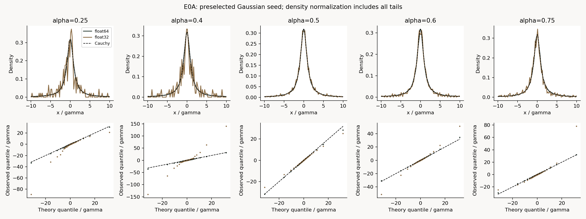
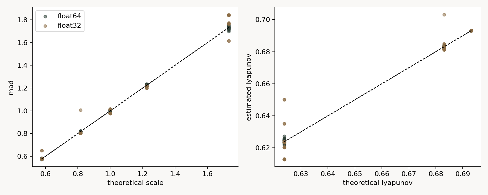
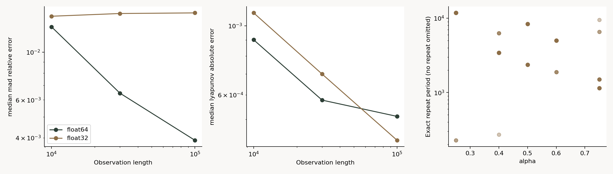
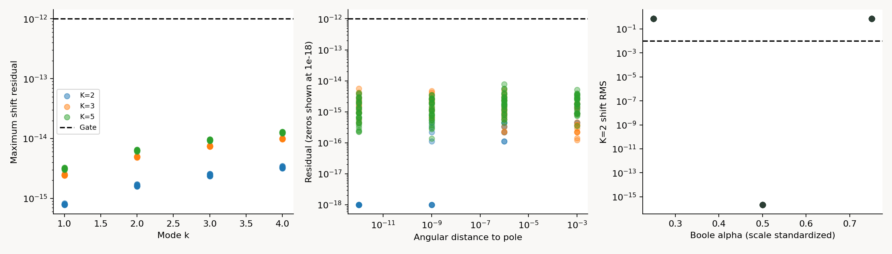
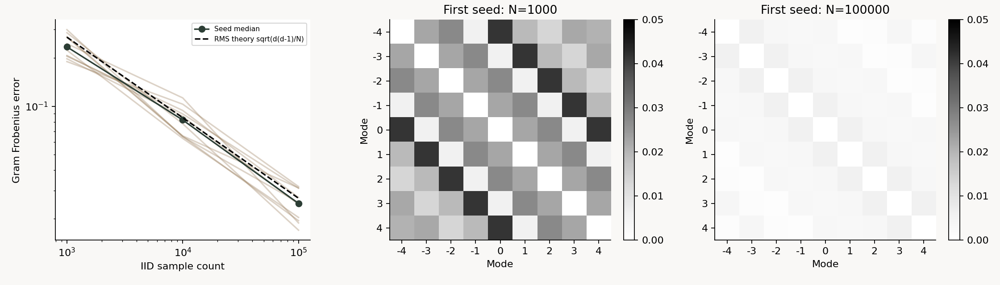

# E0: 単一写像と基底の数値検証

E0Aのfloat64整合性に続き、E0BのK-fold/Cayley/TM正対照を完了した。E0Bは事前判定12/12、独立検証104/104を通過。E0Aのfloat32不合格は保持する。

以下にE0A、続いてE0Bの目的・理論・結果を記録する。

## E0A: 一般化Boole写像の理論・初期分布・精度監査

実験ID: E0A-BOOLE-LOCAL-VALIDATION  
実行日: 2026-09-05  
状態: **実験・保存・独立検証完了。float64の整合性を支持、float32監査は不合格。E0全体の完了・モデル完成ではない。**

## 目的と研究全体での位置づけ

最終目標は、カオス同期で冗長自由度を減らしつつ入力情報を保持するエンコーダと、その表現から入力を復元するデコーダの構築である。本実験は、その前提となる単一ノードの写像・分布・数値精度を検証する。

9月4日版[実験テキスト](../chaos-sync-tm-self-implementation/docs/chaos_sync_tm_experiment_textbook_ja.pdf)の2.2節・3.1節（PDF通し13–17ページ）に従う。旧E0のα=0.4,0.5,0.6・不変分布初期化の結果では、今回の5 α・3初期分布・精度比較を代替できない。旧runは改名・上書きしていない。

## 原理・理論的整合性

写像を次に固定する。一般化Boole写像であり、Booleanの二値状態ではない。

\[
F_\alpha(x)=\alpha(x-1/x),\qquad 0<\alpha<1,\quad x\ne0.
\]

一般形 \(T_{\alpha,\beta}(x)=\alpha x-\beta/x\) の **β=α** に当たる。βを固定した別モデルの尺度式と混同しない。[Umeno・Okubo (2016)](https://doi.org/10.1093/ptep/ptv195)の式(2)–(5)、Theorem 2との対応を確認した。

中心0のCauchy分布の尺度写像は \(G_\alpha(\gamma)=\alpha(\gamma+1/\gamma)\) であり、正固定点は

\[
\gamma_*=\sqrt{\frac{\alpha}{1-\alpha}},\qquad G_\alpha'(\gamma_*)=2\alpha-1.
\]

この収縮は**分布の尺度**の局所安定性であり、個々の初期値差の収縮やノード間同期を意味しない。Gaussian・一様分布の過渡全体がこの1変数尺度写像に従うとも仮定しない。

実数写像の導関数と不変測度に対するLyapunov指数は

\[
F_\alpha'(x)=\alpha(1+x^{-2}),\qquad
\lambda=\log[1+2\sqrt{\alpha(1-\alpha)}]
=2\log(\sqrt\alpha+\sqrt{1-\alpha}).
\]

不変分布下の時間平均と閉形式を比較し、独立な角度変数の数値積分でも照合する。Cauchy分布には母平均・母分散が存在しないため、尺度推定には**正規分布用係数を掛けないMAD**とhalf-IQRを使う。標本平均・標本標準偏差は診断値としてのみ保存する。

有限精度の状態空間は有限である。決定論的な更新で状態が再訪すれば、以降は同一周期を繰り返す。周期化した軌道で実数写像の導関数平均が正でも、離散化された計算過程の非周期カオス性を保証しない。

## 仮説・反証条件

| 仮説 | 事前条件 | 結果 |
|---|---|---|
| H1: float64で尺度と指数を再現する | 各α・初期分布の5 seed中央値でMAD相対誤差≤5%、Lyapunov絶対誤差≤0.02 | 15/15群で支持 |
| H2: float64で観測長を増やすと全体誤差が減る | 75条件の誤差中央値がT=10,000から100,000で両指標とも減少 | 支持 |
| H3: float32でも結論が反転しない | H1と同一基準を精度別に判定 | 棄却。α=0.75の3群が不合格 |
| 数値健全性 | 失敗を除外せず保存、clip・jitter・再初期化なし | 150/150条件完走。float32は全条件で周期化 |

H2は全群での単調減少、無限長での一致、標本独立性を要求しない。T=30,000は中間診断であり、結果を見て閾値・seed・burn-inを変更していない。H3不合格後にfloat32を除外して全体合格へ変更することもしない。

## 実験方法

- α: 0.25, 0.40, 0.50, 0.60, 0.75。
- 初期分布: 標準Cauchy、標準Gaussian、一様U(-1,1)。各5 seed。
- seed: 20260905–20260909。PCG64とSeedSequence([seed, distribution_index])。
- 同一初期値をα間・精度間で対応させ、入口でdtypeへ変換。conditions.csvに初期値を保存。
- burn-in: 20,000更新。観測は \(x_{20001}\) から100,000点。先頭10,000・30,000・100,000点を評価。
- float64主実験75条件、float32監査75条件、計15,000,000観測点、条件・長さ別450行。
- 各ノードは独立に更新。結合・訓練・デコーダは本段階にない。
- 更新演算は指定dtypeを保持。指標集計は両精度ともfloat64。log導関数は同値なlogaddexp式で中間overflowを回避。
- 近傍閾値: \(|x|<10^{-12},10^{-10},10^{-8}\)。更新入力の全期間回数と観測窓内回数を分離。
- CSVのbatch_simulation_secondsは同じ精度の75条件を一括実行した時間であり、各行固有の実行時間ではない。
- 5 seedは反復単位。対応条件や同一軌道の窓を独立標本として数えない。float32では異なるseedが同じ周期へ入る場合もある。

Python 3.12.10、NumPy 1.26.2、SciPy 1.16.2、Matplotlib 3.9.1、Windows 11。実測longdoubleはfloat64と同じ52仮数bitであり、高精度追試にはならない。

## 数値結果

下表は各αについて、3初期分布それぞれの「5 seed中央値」の最大値を示す。個々のseed最大誤差ではない。全30群はsummary.json、全450行はmetrics.csvが正本である。

| alpha | float64 MAD相対誤差 | float64 Lyapunov絶対誤差 | float32 MAD相対誤差 | float32 Lyapunov絶対誤差 |
|---|---:|---:|---:|---:|
| 0.25 | 0.7306% | 0.0018024 | 0.1929% | 0.0003987 |
| 0.4 | 0.4885% | 0.0003255 | 1.4038% | 0.0017283 |
| 0.5 | 0.4984% | 0.0000188 | 2.2365% | 0.0000244 |
| 0.6 | 0.5180% | 0.0005549 | 0.8053% | 0.0002900 |
| 0.75 | 0.8260% | 0.0010657 | 6.2909% | 0.0109125 |

float64全75条件のMAD相対誤差中央値は **1.3119% → 0.6449% → 0.3895%**、Lyapunov絶対誤差中央値は **0.0009013 → 0.0005767 → 0.0005112**（T=10,000 → 30,000 → 100,000）。

全150条件でゼロ・非有限値による停止は0件、3閾値の近傍通過回数も全期間0件だった。極近傍の実験的挙動が検証済みという意味ではない。失敗停止契約は単体テストで確認した。

float32は全75条件が観測窓先頭から周期に入り、周期長は227–11,795。独立validatorが最初の再訪から末尾まで全要素の周期一致を確認した。float64は100,000点内の厳密な再訪0/75。

| alpha | float32で観測された周期長 |
|---|---|
| 0.25 | 227, 11795 |
| 0.4 | 270, 3433, 6283 |
| 0.5 | 2356, 8350 |
| 0.6 | 1876, 5004 |
| 0.75 | 1144, 1500, 6584, 9476 |

α=0.75のfloat32では、1周期だけのMAD相対誤差にも約6.44%、6.72%の周期がある。同じ周期の反復では、この周期固有の偏りは消えない。α=0.25や0.4は群中央値ゲートを通過しても、一部seedのMAD誤差は12.53%、23.43%に達した。中央値合格を全軌道の健全性と同一視しない。

## 図と読み方

図1: 理論Cauchy密度・QQ。事前指定したGaussian初期化・先頭seedを表示。密度は図外の裾も含む全標本数で正規化し、QQ端点差も隠していない。

図2: 全150条件の理論尺度対MAD、理論指数対時間平均指数。破線は一致線。外れた条件も表示する。

図3: 誤差中央値の観測長依存とfloat32の周期。再訪のなかったfloat64は右図の点を持たない。全図は保存CSV/NPZから再生成可能。

## 考察・原因分析

**確認できたこと:** float64は今回の初期分布・α・観測長でCauchy尺度と指数を再現した。独立積分と閉形式の差は最大約3×10^-15。float32ではclipなしでも全軌道が有限周期に固定され、一部で尺度の偏りを生んだ。周期化は同一状態の再訪と全後続点の一致で確認した。

**原因の切り分け:** 同一初期値・同一演算順序で精度だけを変えた対応比較で差が出た。独立な式による全再生も一致した。ゼロ・非有限値・設定した特異点近傍への通過がなく、clipもないため、それらによる写像変更は原因ではない。周期の尺度偏りが長時間誤差と対応し、有限精度周期化を主要因と判断する。どの丸め操作が各周期への分岐を決めたかのbit単位分類は未実施。

**限界:** 5 seed・有限長・単一CPU/NumPy環境での観察である。float64の無限時間非周期性、他のα、外力・結合系、任意の初期値は保証しない。別環境で演算順序・dtype・乱数実装が変われば、カオス軌道の点ごとの一致は期待できない。環境固定時のビット一致再生と、環境変更時の統計ゲート・周期監査を分ける。

## 判断・展望

- E0Aは正負の結果、原因、入力・出力、検証を揃えた実験として完了。全精度合格は未達。
- float32はこの長時間軌道生成の標準には採用しない。float64は今回の範囲でのみ採用可能。
- 当時の次計画（本書後半で実施済み）: **E0B: K-fold/Cayley/TM基底の正対照**をfloat64で事前登録する。K=2,3,5、k=1,2,3,4のshift残差、極近傍別集計、Gram行列の標本長依存を測る。K-fold恒等式を任意のαへ流用しない。
- その後E1読み出し、E2頑健性、E3同期と入力保持へ進む。結合系にも精度・周期監査を引き継ぐ。
- エンコーダ・デコーダの成立には、入力→状態/外力→潜在表現→復元の定義と、情報保持・復元誤差・量子化後符号長の評価が必要。合成信号復元はテキストE4、画像はE5。
- 本実験は同期・圧縮率・復号性能・TM優位を測っていない。合成信号生成や学習器は、その段階で仕様を定めて共通srcへ追加する。

## 再現方法と成果物

プロジェクト直下で実行する。既存出力先は上書きできない。

~~~powershell
python -m unittest discover -s experiments/tests -p test_e0_boole_validation.py -v
python experiments/E0/run_e0.py --output experiments/E0/artifacts/boole_local_replication
python experiments/E0/validate_results.py --output experiments/E0/artifacts/boole_local_replication
~~~

今回の保存データの検証は python experiments/E0/validate_results.py。

- [config.json](config.json): 事前固定した条件・仮説・ゲート。
- [共通実装](../src/core.py): 写像・解析値・導関数・軌道生成。
- [run_e0.py](run_e0.py): 実験条件・指標・図。plot_resultsで保存NPZから再描画できる。
- [validate_results.py](validate_results.py): 共通実装をimportしない全再生、独立集計・積分・周期・ハッシュ照合。
- [metrics.csv](artifacts/boole_local_validation/metrics.csv): 条件・長さ別450行。
- [summary.json](artifacts/boole_local_validation/summary.json): 全群の合否と誤差曲線。
- [validation.json](artifacts/boole_local_validation/validation.json): **50/50項目合格**、各周期のMAD・周期集合ハッシュ。
- orbits_float64.npz / orbits_float32.npz: 実際の全軌道と失敗・近傍診断。
- conditions.csv / plot_data.csv: 初期値と条件対応、密度/QQの図データ。
- environment.json / source_code.zip / sha256.txt: 環境、実行時コード凍結、成果物ハッシュ。
- artifacts/pilot: 1条件1万点の実装確認。本結果は150条件で判断する。

既存E0テストを拡張し**7件合格**。validator初回のNumPy真偽値のJSON保存失敗はPython boolへの変換で修正した。pilotで未実施float32が空集合のall()により合格表示された点も修正し、元表示と訂正理由をpilot summaryに保持。本実験の数値・ゲートは変更していない。修正前の実行時コードをZIPに保存し、修正後validatorのSHAはvalidation.jsonに記録した。

成果物ハッシュは自己参照を避けてvalidation.json自身を含めない。validation.jsonは再生成可能で検証コードのSHAを内包する。全軌道・図を含む証拠ファイルを今回のPRに含める。Gitの既存ルールで通常除外されるNPZ・PNGは明示的に追加し、E0/.gitattributesでartifacts配下の改行変換を無効化して保存済みSHA-256を維持する。

## 参考文献・主張の境界

1. 実験テキスト v1.0（2026-09-04）、2.2節・3.1節。PDFのSHAをenvironment.jsonに記録。
2. Umeno・Okubo, PTEP 2016, 021A01, [DOI](https://doi.org/10.1093/ptep/ptv195)。参照範囲は単一写像の不変測度と指数式。
3. [ローカル無限次元同期原稿](../../references/papers/infinite-dimensional-chaotic-synchronization.pdf)、式(2)・K=0の尺度式。**結合系の厳密縮約・普遍閾値は、この検証から確認できない。**

## E0B: K-fold写像・Cayley/TM基底の正対照

実験ID: E0B-KFOLD-TM-SHIFT-CHECK  
状態: **float64で本実験完了。事前ゲート12/12、独立検証104/104、既存拡張テスト8件通過。**  
E0Aのfloat32不合格は変更しない。今回の標本は独立に生成しており、E0Aの周期化問題を「解消した」実験ではない。

### 目的・仮説

テキスト2.3–2.4節・3.2節に従い、後段の読み出しで使う有界座標と基底の計算を検証する。実験の単位は標準Cauchy分布からの独立標本であり、同期ネットワークやエンコーダではない。

- H1: K-fold写像の合成で \(M_k(H_K(x))=M_{Kk}(x)\) が数値精度内で成立する。
- H2: Cauchy測度下のCayley power modesのGram行列が、標本数を増やすと単位行列へ近づく。
- H3: 理論不変尺度を用いても、一般のBoole写像ではK=2のshift恒等式を流用できない。

### 原理と独立導出

\[
\theta\sim U(0,\pi),\quad x=\cot\theta,\quad
q(x)=\frac{x-i}{x+i}=e^{-2i\theta},\quad M_k(x)=q(x)^k.
\]

変数変換のJacobianから \(x\) の密度は \(1/[\pi(1+x^2)]\) となる。したがって

\[
\langle M_k,M_\ell\rangle
=\frac{1}{\pi}\int_0^\pi e^{2i(k-\ell)\theta}\,d\theta
=\delta_{k\ell}.
\]

\(H_K(x)=\cot(K\,\operatorname{arccot}x)\) と置き、枝を \(\operatorname{atan2}(1,x)\in(0,\pi)\) に固定すると、極を除いて

\[
M_k(H_K(x))=e^{-2iKk\theta}=M_{Kk}(x).
\]

これは**Koopman作用のモード添字の変換**であって、一般の \(M_k\) が固有関数という主張ではない。有限範囲のモードはK倍の添字に写るため、切り詰めた空間が閉じるとも限らない。使用するのはテキストの同一中心・尺度のpower basisであり、異なる極を持つ一般のTakenaka–Malmquist系全体を検証したものではない。

異なる整数モードをd個使うと、IID標本でのGram誤差には

\[
\mathbb E\|\widehat G-I\|_F^2=\frac{d(d-1)}{N}
\]

が成り立つ。対角成分は1、各非対角成分は平均0の単位複素数の標本平均となり、その二乗絶対値の期待値が1/Nだからである。今回d=9なので、図には \(\sqrt{72/N}\) を比較用RMS曲線として表示する。これはseed中央値の厳密な理論値や信頼区間ではない。

標準化したBoole写像は、\(X=\gamma_*x\) とすると

\[
\frac{F_\alpha(\gamma_*x)}{\gamma_*}
=\alpha x-\frac{1-\alpha}{x}.
\]

α=0.5だけが \(H_2(x)=(x-1/x)/2\) に一致する。α=0.25,0.75は尺度を適切に除いても同じ写像ではない。これを負対照にする。

### 方法・事前判定

設定は [config_e0b.json](config_e0b.json) に実行前に固定した。

| 項目 | 設定 |
|---|---|
| 精度 | float64 / complex128 |
| seed | 20260915–20260924、10個 |
| 標本 | 各seedで100,000点。先頭1,000・10,000・100,000点を評価 |
| RNG | PCG64(seed)、theta=π×U、x=cos(theta)/sin(theta) |
| K | 2,3,5 |
| shiftの次数 | k=1,2,3,4 |
| Gramの次数 | k=-4,…,4、計9モード |
| 極近傍 | jπ/Kから角度±10^-3, ±10^-6, ±10^-9, ±10^-12 |
| 極診断 | \(|\sin(K\,\operatorname{atan2}(1,x))|<10^{-10}\) |
| 負対照 | α=0.25,0.75。α=0.5は同じ実装経路の正対照 |

通常標本100万点、shift条件120行、Gram条件30行、Boole対照30行、極監査236行を保存した。標本長別の窓は入れ子であり、独立した30実験とは数えない。同じ入力標本をK・次数・α間で対応させた。

主ゲートは最大shift残差≤10^-12、単位円半径誤差≤10^-14、最大Nで全seedのGram Frobenius誤差≤0.08、各seedとseed中央値で最小N→最大Nの誤差減少、入力・出力のCauchy CDF距離≤0.01とした。Gramの0.08は工学的許容値であり有意水準ではない。負対照では全seedのRMS残差≥0.01、α=0.5では≤10^-12を要求した。

既知の厳密な入力x=0は、偶数KでH_Kが未定義になるためNaN・非有限マスクを返す。奇数Kでは解析値0を返す。sin(nπ)の丸め残差を使って「極なのに巨大な有限値」と判断することを防いだ。他の極は浮動小数で厳密な代数的等号を一般判定せず、近傍マスクと別集計を用いる。極近傍の値をclipしたり、乱数を再生成してやり直したりしない。

### 結果

| 評価量 | 結果 | 判定 |
|---|---:|---|
| 通常標本の最大shift残差 | 1.3028×10^-14 | ≤10^-12 |
| 有限な極近傍標本の最大残差 | 5.6438×10^-15 | ≤10^-12 |
| 単位円半径の最大誤差 | 1.5543×10^-15 | ≤10^-14 |
| N=100,000の最大Gram誤差（10 seed中） | 0.031706 | ≤0.08 |
| 入力CDF距離の最大値 | 0.004744 | ≤0.01 |
| 出力CDF距離の最大値 | 0.005752 | ≤0.01 |
| 正対照α=0.5のRMS残差中央値 | 2.1383×10^-16 | 恒等式に整合 |
| 負対照α=0.25のRMS残差中央値 | 0.707317 | 恒等式は成立しない |
| 負対照α=0.75のRMS残差中央値 | 0.707106 | 恒等式は成立しない |

Gram誤差のseed中央値は **0.233594 → 0.082157 → 0.024905**（N=1,000 → 10,000 → 100,000）に減少し、全10 seedで端点間の減少を確認した。通常IID標本では非有限値も指定した極近傍への該当も0件。別途構成したストレス標本では、有限な極近傍56行と、厳密な極4行（K=2、k=1..4）を区別して保存した。

### 図の見方

左: 各点は1 seed・K・kの最大shift残差。破線10^-12より下なら精度基準内。色はKを表す。中央: 各極からの角度距離と残差。ゼロ残差だけは対数図の表示上10^-18へ置き、CSVの値は変更していない。右: 尺度を除いたBoole写像にK=2の恒等式を当てた残差。α=0.5だけが丸め誤差程度になり、α=0.25,0.75は負対照の下限0.01より上にある。

左: 薄い線は各seed、濃い線はseed中央値、破線は理論RMSの比較曲線。中央・右: 事前指定した先頭seedの \(|\widehat G-I|\) を共通の色範囲で表示する。白いほど誤差が小さい。表示しているのはGそのものではないため、対角成分は1ではなく誤差0として白くなる。一般に平均と中央値は異なり、中央値曲線が理論RMSと完全に重なる必要はない。

### 考察・採否

H1–H3を今回の有限な条件範囲で支持する。基底の数値評価、Cauchy測度下の直交性、K-foldのshift正対照を後段実験へ使える。ただし、数値実験が全実数・全次数に対する証明を代替するわけではない。数式の恒等性は上記の独立導出、数値実装の整合性は保存結果で確認している。

有界なCayley座標の残差が小さいことと、極近傍における生のH_K(x)の相対誤差が小さいことは別である。本監査は前者を判定した。極近傍の生の軌道を長時間反復したときの数値健全性や、高いK・次数・任意尺度は未検証。

**採用:** float64のCayley power modesとK-fold正対照。**棄却:** 一般のBoole写像でも同じshift恒等式が使えるという拡張。負対照は「一般のBoole写像に情報がない」ことを意味しない。むしろ同じ周辺分布でも時間発展は異なり得るため、次は時間遅延特徴で差を読めるかを調べる。

E0Aはfloat64に限定した整合性を支持し、E0Bは今回のfloat64条件で合格した。float32を含む無条件のE0合格には変更しない。E1ではこの限定と周期診断を引き継ぎ、基底が情報を新たに作るとは仮定しない。

### 再現方法・保存物

~~~powershell
$env:OPENBLAS_NUM_THREADS = '1'
$env:OMP_NUM_THREADS = '1'
python -m unittest discover -s experiments/tests -p test_e0_boole_validation.py -v
python experiments/E0/run_e0b.py --output experiments/E0/artifacts/kfold_tm_replication
python experiments/E0/validate_results.py --output experiments/E0/artifacts/kfold_tm_replication
~~~

今回の結果の検証だけなら、最後の出力先を kfold_tm_validation にする。別環境のBLAS・三角関数による最終bit差はあり得るため、環境固定の再生と数値許容誤差による独立照合を区別する。実行時はNumPy 1.26.2、Matplotlib 3.9.1、Python 3.12.10、上記2スレッド変数を1に設定した。

- [run_e0b.py](run_e0b.py): 条件生成・指標・描画。共通のCSV保存関数は既存run_e0.pyを再利用。
- [共通core](../src/core.py): cayley_modesとkfold_cotangentを追加。旧Boole更新式は変更していない。
- [validate_results.py](validate_results.py): 設定の実験IDでE0A/E0Bを分岐。位相表示、複素多項式、標準化Boole式による別経路で検証。
- [summary.json](artifacts/kfold_tm_validation/summary.json): 科学的判定12項目と集約値。
- [validation.json](artifacts/kfold_tm_validation/validation.json): 独立検証104項目。科学的成功と保存物の整合性は別判定。
- shift_metrics.csv / gram_metrics.csv / control_metrics.csv / pole_metrics.csv: 未集約の全指標。
- samples_seed_*.npz: 全theta、x、Cayley座標q、各Kの写像出力、標本長別Gram行列。モードは保存qと整数次数から復元できる。
- source_code.zip / environment.json / sha256.txt: 実行時ソース、環境、ハッシュ。検証JSONは自己参照を避けて成果物ハッシュから除外する。
- 図の再描画はrun_e0b.pyのplot_resultsと保存CSV/NPZを使用する。

E0Aの成果物は保持し、E0Bの生成物だけを artifacts/kfold_tm_validation に追加した。新しいテストファイルや別の共通コード階層は作っていない。
