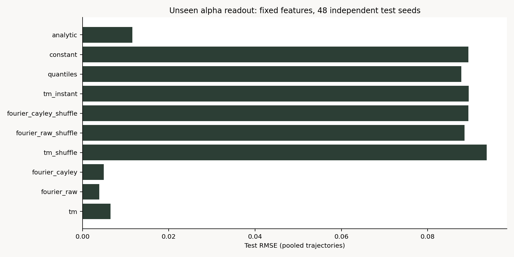
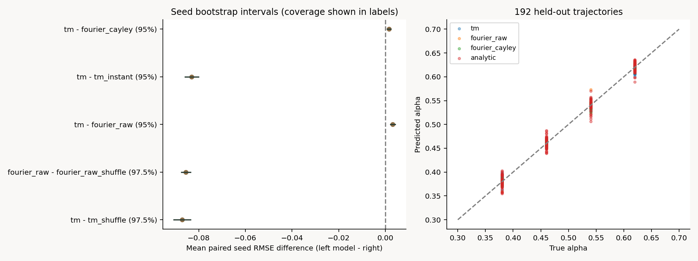

# E1: 力学適合性・情報読み出し・識別可能性

2026-09-06: 添付方針を再検討し、[TM-A仕様・結果とTM-B/TM-Cの計画](TM_DYNAMICS.md)を追加した。168軌道・396独立チェック。TMと角度Fourierの同値性、有限辞書の打切りを確認し、全targetでのTM優位は未支持。同期後の入力保持はE3Cで別検証する。以下は既存E1Aの記録。

## E1A: 固定16次元特徴による単一源α読み出し

状態: **2026-09-05、E1A実行・保存・独立検証完了。時間順序の有用性を支持し、固定TM16優位は棄却。E1Bへ進める。** E0のfloat64実装を引き継ぐ。

## 目的・仮説

尺度差を軌道内median・half-IQRで抑えた後の時間順序に、未学習のαを読み出せる情報があるか調べる。
H1: TMまたはraw Fourierがそれぞれのshuffleより良い。二比較の各97.5%両側seed-bootstrap区間の上限が0未満なら支持（Bonferroni、family 5%）。
H2: 固定TM16がraw Fourier16より良い。seedごとのRMSE差(TM−Fourier)の平均の95%区間上限<0を基準とする。
H3: TM16が遅延なしTM16より良い。同じ差の95%区間上限<0。満たさなければ時間相関の必要性は未支持。
H2/H3は別個の事前仮説であり、全比較をまとめた同時95%保証は主張しない。

## 理論整合性

Fα(x)=α(x−1/x)、γ*=sqrt(α/(1−α))。z=x/γ* とおくとGα(z)=αz−(1−α)/z。
q=(z−i)/(z+i)、r=2α−1なら、代数変形でq(Gα(z))=q(q+r)/(1+rq)となる。
不変Cauchy測度下ではqは単位円上一様。|r|<1なので1/(1+rq)を収束級数展開でき、
E[q(t+1) conjugate(q(t))]=E[(q+r)/(1+rq)]=r。
従って母相関C11はαを保持する。α=(1+Re C11)/2という学習不要の推定を診断対照として保存する。
これは真の尺度・定常測度の母期待値についての導出であり、有限窓の標本median・half-IQRや単一軌道の推定量に厳密等式を主張しない。
同時刻のモード平均は理想定常分布では0であるが、有限窓ではゆらぎの分布がαに依存し得る。lagなし/quantileの性能が完全に偶然水準になるとは仮定しない。
一般BooleにK-foldのshift恒等式を適用しない。同期系・圧縮率・復号の検証ではない。

## 実験手法と事前固定

- train: α={0.34,0.42,0.50,0.58,0.66}、32 seed（160軌道）。validationは同じα、別16 seed（80軌道）。testはα={0.38,0.46,0.54,0.62}、別48 seed（192軌道）。
- 各(seed,α整数値)からSeedSequenceで独立標準Cauchy初期値を生成。float64、burn-in=20,000、観測4,096。clip・再初期化・失敗除外なし。全軌道・初期値・特異点近傍回数・有限性・厳密再訪を保存。
- 軌道内標準化はラベルを使わない観測窓全体の変換。オンライン推定ではない。特徴の列標準化とridgeはtrainのみでfit。validationで5候補からpenaltyを選び、再fitせずtest生成前にモデルを保存する。
- TM: k=1..4、lag=1,2の同次数相関、実部/虚部16次元。候補選択なし。
- 主Fourier: 標準化実数軌道を平均中心化しHann窓、rFFTからDCを除き等個数16帯域。log(1e−12+帯域平均power)、power=|FFT|²/sum(window²)。Cauchy母分散は存在しないため有限標本の診断特徴とし、安定な母PSDとは呼ばない。
- 補助Fourier: boundedなCayley実部・虚部それぞれ8帯域（計16）。同じ窓・power定義。主比較とは別に報告する。
- 同一permutationのTM、raw Fourier、Cayley Fourier shuffle対照。lagなしTMはk=1..8で16次元。標準化後の16分位点も対照。計8特徴モデル、全て同じridge候補。train平均予測と理論式の推定は学習容量比較に含めない。
- 同じseedの4 test αを1 clusterとする。10,000 bootstrap、Δs=RMSEmodel,s−RMSEreference,sの平均と区間を保存。全行をpoolしたRMSE差と混同しない。
- H1の統計条件に加え、全軌道有限・再訪0・α/seed分離・同次元・同じ探索予算をE1A移行ゲートに要求する。TM優位は移行の必須条件としない。

既存の容量一致runとは、seed・burn-in・TM構成固定・Fourier定義が異なる。過去のRMSEへ合わせる再調整はしない。

## 実験結果

事前コミット `44f92ab` で設定・実装・仮説を固定し、本実験を一度実行した。432軌道（train 160、validation 80、test 192）、観測計1,769,472点。非有限値、観測窓内の厳密再訪、burn-inを含めた |x|<1e−8 の更新入力はすべて0件だった。これは観測範囲の数値健全性であり、無限長非周期性の証明ではない。

選択凍結は09:25:49.965993 UTC、test生成開始は09:25:49.971502 UTC。選択済みモデルファイルのSHA-256も保存した。8特徴それぞれ5候補で選択し、TMはpenalty=1、raw/Cayley Fourierは0.01、shuffle・lagなし・quantileは100となった。testで再選択していない。

### test全192軌道をpoolした指標

| モデル | 特徴次元 | RMSE | MAE | R² |
|---|---:|---:|---:|---:|

| 固定TM | 16 | 0.006507 | 0.004998 | 0.994707 |
| 実数Fourier（主比較） | 16 | 0.003912 | 0.002168 | 0.998087 |
| Cayley Fourier（補助） | 16 | 0.004906 | 0.003821 | 0.996992 |
| TM shuffle | 16 | 0.093720 | 0.082315 | -0.097928 |
| 実数Fourier shuffle | 16 | 0.088541 | 0.079100 | 0.020071 |
| Cayley Fourier shuffle | 16 | 0.089471 | 0.077735 | -0.000632 |
| 遅延なしTM | 16 | 0.089524 | 0.077313 | -0.001812 |
| 分位点 | 16 | 0.087807 | 0.076755 | 0.036239 |
| train平均定数 | 比較対象外 | 0.089443 | 0.080000 | 0.000000 |
| 解析式 (1+Re C11)/2 | 比較対象外 | 0.011558 | 0.009119 | 0.983302 |

解析式は1つの相関統計から計算する学習なし推定であり、表の「比較対象外」は情報入力が0次元という意味ではない。

### seed単位の差と判定

差は左のモデルのseed内RMSEから右を引き、48 seedで平均する。正なら右が良い。上表のpooled RMSE同士の差とは集計順序が違う。

| 左 − 右 | seed平均差 | bootstrap区間 | 区間水準 |
|---|---:|---:|---:|
| 固定TM − TM shuffle | -0.087050 | [-0.090646, -0.083537] | 97.5% |
| 実数Fourier（主比較） − 実数Fourier shuffle | -0.085467 | [-0.087410, -0.083547] | 97.5% |
| 固定TM − 実数Fourier（主比較） | 0.003114 | [0.002064, 0.004116] | 95% |
| 固定TM − 遅延なしTM | -0.082983 | [-0.085904, -0.080119] | 95% |
| 固定TM − Cayley Fourier（補助） | 0.001506 | [0.000737, 0.002254] | 95% |

- H1（時間順序の情報）: **支持**。TM、raw Fourierの両方で、対応shuffleとの差の97.5%上限が0未満。
- H2（固定TM16優位）: **今回の条件で棄却**。TM−raw Fourierの95%区間は全体が正。48 seedのうち42 seedでraw FourierのRMSEが小さい。Cayley Fourierに対しても同方向だが、この比較は補助診断である。
- H3（遅延相関の有用性）: **支持**。遅延なし16次元との差の95%上限が0未満。全ての読み出し法に時間相関が必須であるとの一般的必要条件は証明しない。
- E1B移行ゲート: **通過**。時間情報・分割・次元/探索予算・有限性・再訪監査を満たした。TM優位や同期成功を通過条件へすり替えない。

### α別RMSE

| test α | 固定TM | 実数Fourier | Cayley Fourier | 解析式 |
|---:|---:|---:|---:|---:|
| 0.38 | 0.008627 | 0.004058 | 0.004474 | 0.012261 |
| 0.46 | 0.004784 | 0.002641 | 0.005191 | 0.011739 |
| 0.54 | 0.005072 | 0.005541 | 0.005150 | 0.011903 |
| 0.62 | 0.006806 | 0.002659 | 0.004773 | 0.010223 |

α=0.54ではTMのRMSEがraw Fourierより小さい。全α・全seedでFourierが優れるとは言えない。

## 図の見方



横軸はtest全体のRMSEで、小さいほど良い。縦軸はモデル。時間順序を保存した3モデルの棒が短く、shuffle・lagなし・分位点は定数予測に近い。これは性能の図であり同期率や圧縮率ではない。



左: 点はseed平均差、横線はbootstrap区間、縦破線0は同点。TM−shuffleは左側、TM−Fourierは右側にある。比較ごとの水準は行名に明記。右: 横軸は真のα、縦軸は予測、破線y=xに近いほど正確。4本の縦列は未学習のtest α、各点は独立seedの軌道。2図とも保存CSVから描画し、表示崩れも目視確認した。

## 考察・理論との整合性

母相関C11=2α−1という導出と、尺度を抑えた有限窓からのα回収は整合する。解析式だけでもRMSE 0.011558で定数予測より小さい。一方、標本median・half-IQRの誤差、相関推定の有限時間ゆらぎがあるため、解析式が標本ごとにαと一致するとは期待しない。複数相関を使うridgeの改善要因の内訳は今回分離していない。

今回の固定TM16は、過去の「瞬時モードも含む短遅延候補をvalidation/CVで選ぶ」構成と異なる。旧runは別の独立実験として保持する。今回と旧runではTM構成・Fourier定義・seed・burn-in等が同時に異なり、逆転の原因を一つに断定できない。少なくとも「16次元ならTMが常にFourierより良い」という一般化は支持できない。

実数FourierにはCauchy母PSDの存在を仮定していない。非常に大きな有限値が帯域powerを左右するため、頑健性には別の検証が必要である。ただしboundedなCayley Fourierも今回TMより良く、rawの巨大値だけで比較結果を説明できるとは言えない。

正規化は個々の観測窓を用いるオフライン変換で、元のlocation・scaleはdecoderへ渡していない。これは真の母周辺分布を厳密に一致させる操作ではなく、有限窓の高次分位点等に残るα依存性までは除去しない。したがって対照の小さな改善を直ちに漏洩と扱わない。

bootstrapは48 test seedを再標本化し、fit/validation/モデル選択を固定した条件付きの区間である。学習データを作り直したときの変動、α母集団全体、外挿への不確実性は含まない。時刻点を独立標本として数えていない。

## 展望・次の実験

次は教材E1Bで、二源の既知full-rank観測の正対照と、rank-one対称観測の源入替えによる識別不能性を比較する。順序付きターゲットの下限を導出し、swapペアを同じsplitへ固定する。TMだけを採用せず、Fourier対照も維持する。

旧runとの逆転要因の分離は別追試候補（特徴構成のみを変え、新しいtest seedを使う）。今回のtestでTM次数・遅延・窓を再選択しない。同期・圧縮・復号・画像タスクの成功は未検証であり、E1Aはパラメータ読み出しの検証に限定する。

## 再現方法・証拠

プロジェクト直下から実行する。既存出力を指定すると停止するため、追試には別の出力名を使う。

```powershell
$env:OPENBLAS_NUM_THREADS = '1'
$env:OMP_NUM_THREADS = '1'
python -m unittest experiments.tests.test_e1a_temporal_alpha_readout.FixedReadoutTests
python experiments/E1/run_e1.py --output experiments/E1/artifacts/fixed_readout_replication
python experiments/E1/validate_results.py --output experiments/E1/artifacts/fixed_readout_replication
```

今回の証拠の検証は `python experiments/E1/validate_results.py`。本実験と独立validatorが完了し、**155/155項目通過**。既存E1テストファイルに追加した1テスト単位で、母相関の数値積分、同容量、shuffleの瞬時統計保持、旧ridgeとの一致、seed重複拒否、最小runの全証拠・独立検証・上書き拒否を確認した。

- [config.json](config.json): 実験前に固定した設定。実行に使った値はartifactsにも複製。
- [run_e1.py](run_e1.py)、[共有readout](../src/readout.py): 実行本線。E0の共通軌道生成とCSV・周期診断を再利用。
- [validate_results.py](validate_results.py): 共通コードをimportせず全軌道再生、角度表現による特徴、拡大最小二乗によるridge、選択、予測、bootstrap、ハッシュを照合。
- [summary.json](artifacts/fixed_readout/summary.json)、[validation.json](artifacts/fixed_readout/validation.json): 科学的ゲートと記録の整合性を別々に保存。
- `*_orbits.npz`: 全観測軌道、初期値、seed、α、生成診断。`*_features.npz`: 8特徴の全行列。
- `*_conditions.csv`: split・seed・α・初期値・robust統計・周期/近傍診断。`validation_candidates.csv`、`selection.json`、`models.npz`: 40候補の値と凍結済みモデル。
- `predictions.csv`、`metrics.csv`、`seed_metrics.csv`、`alpha_metrics.csv`、`contrasts.csv`: 全test予測と条件別・seed別指標。`bootstrap.npz`: 再標本化indicesと各比較の差分布。
- `source_code.zip`、`environment.json`、`sha256.txt`: 実行前のソースと事前レポート、環境/時刻、成果物ハッシュ。現在のREADMEの結果追記は実行後であり、ZIP内の事前計画を更新しない。validator自身のハッシュはvalidation.json内に保存し、validation.jsonは自己参照を避けてmanifestから除外。

実行環境はPython 3.12.10、NumPy 1.26.2、Matplotlib 3.9.1、Windows 11、BLAS/OMP各1スレッド。異なるBLAS/三角関数環境の最終bit一致は保証せず、完全再生と数値許容誤差での独立照合を分ける。参照教材はTeX原本のSHA-256を記録し、PDF生成環境への依存を避ける。

NPZとPNGもPRへ明示的に含める。E1/.gitattributesで成果物の改行変換を止め、SHA-256を保持する。新規実験領域E1以外に階層は増やさず、共通の読み出しはsrc/readout.py、テストは既存ファイルを拡張した。旧runsは履歴として維持する。
