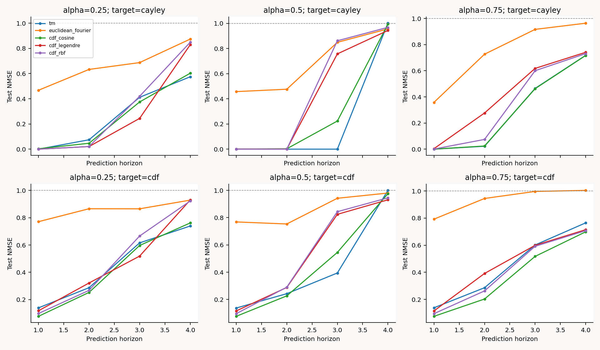
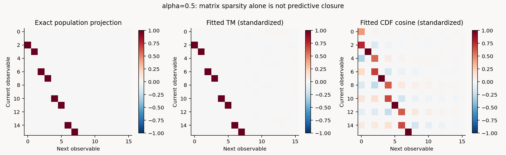

# E1再検討: TMを使う理由と力学適合性の検証

状態: **2026-09-06 JST、方針再検討とTM-A本実験・独立検証完了。TM-B拡張/TM-Cは仕様化済み・未実行。**既存[E1A](README.md)の固定TM優位不成立を維持する。

## 方針と添付内容の主張監査

目的はTM採用の正当化ではなく、軌道に残った情報をどの条件で読み出せるかと限界の検証である。添付文章は研究提案として扱い、文中の「TMでなければならない」「同じ情報容量」等を確定事実として採用しない。

1. ここでのTMは共通Cauchy極のCayley冪。角度Fourierと等価であり、一般の異なる極を持つTakenaka–Malmquist系全体ではない。複素L²(Cauchy)の完全系にはk∈Zを含める必要がある。正のkの実部・虚部と定数は実関数の対応系だが、有限16次元は完全系ではない。
2. 非結合定常Cauchyの直交性を、入力駆動・結合後の未知分布へ無条件に適用しない。測度/極尺度の不一致をGram行列で診断する。
3. 状態変数に作用するFourier観測関数と、時刻方向のFFT特徴は別物。TMとCayley角度Fourierの一致は正対照であり、勝敗比較ではない。
4. 16次元一致は名目次元の一致であって情報量・数値精度・探索自由度の一致の証明ではない。疎性・rankは座標/標準化/閾値に依存し、予測や情報保持を併せて評価する。
5. rank-one和観測の順序付き源にはswap対称性による識別不能性がある。ただし任意の1チャネル観測であらゆる復元が不可能とまでは一般化しない。
6. 同期・入力保持・低次元復元を別ゲートにし、潜在次元対誤差をbit-rate distortionと呼ばない。量子化bit数・通信量を測るまでは次元対歪み曲線に限定する。

## 実験系列の再配置

| 段階 | 入力と出力 | 主な検証と対照 | 判定・状態 |
|---|---|---|---|
| TM-0 / E0B | Cauchy標本→Cayleyモード | Gram、単位円、K-fold shift | 実装整合性は既に通過。実用優位とは別 |
| TM-A / E1追加（今回） | 同一Boole状態→6種16次元辞書→未来の共通観測 | 真尺度、角度Fourier一致、α=.5の打切り、他辞書 | 下記仮説を事前固定して実行 |
| TM-B / E1A継続 | ラベル/入力→軌道→固定特徴→共通ridge/logistic | temporal FFT、DCT、raw PCA、random projection、shuffle | 既存α読み出しは限定的な支持。全候補の優位は未検証 |
| 識別不能対照 / E1B | 二源→full-rank/和観測→順序付きα | exact swap pairを同一split、理論誤差下限 | 現行系列では未実行。旧runは別証拠として保持 |
| TM-C / E3C | 初期入力→結合系→終端窓→ラベル復号 | 同期誤差/次元診断/復号を同じseedとKで測る | 同期後情報保持の中心実験。下記仕様、未実行 |
| TM-4 / E4 | 合成波形→結合軌道→潜在d→波形復元 | d=2,4,8,16,32、同じdecoderとtrain-only PCA | NMSE・コスト・次元対歪み。現段階で圧縮成功は未主張 |

### TM-BとTM-Cで守る仕様

TM-Bでは、力学パラメータαの識別と外部入力uの保持を区別する。まずE1Bの同一源対について既知可逆観測と和観測を比較し、swapの厳密一致と順序付きRMSE下限を検証する。下限は一つのunordered pair {a,b} の均等な2順序に対し|a−b|/2。複数pairでは二乗誤差を重み付き集計してから平方根を取る。基底の優位比較は同じターゲット、16実数、同じ探索数、同じtrain/validation/test pair群を使う。PCA・random projection・DCT等の追加は新testで検証し、既存E1A testは再選択に使わない。

TM-Cの主系は教材の出力混合モデル x(t+1)=[(1−K)I+K11ᵀ/N]Fα(x(t))、N=8、α=.5、K∈{0,.25,.45,.5,.55,.75,1}。自律同期多様体周りの局所式 λ⊥=λF+log|1−K|、Kc=.5 を用いるが、大域同期は実測する。添付の加法的ランダム結合とは異なる。ランダム行和では完全同期多様体が一般に不変でないため、両モデルの臨界値を混ぜない。

入力はx0=c1+a u v+ξ、u∈{−1,+1}、vはzero-sum単位contrast、ξはzero-sum nuisance。t≥0の外場は0とし、同じ(c,ξ)の2ラベルを同一pair splitに置く。終端窓だけを読み、初期窓の正対照とshuffle label負対照を別表示する。入力を維持する外場実験は別条件とし、入力終了後の保持と区別する。

Kごとに①有限標本同期RMSと成功率、②bounded Cayleyノード共分散のparticipation ratio（診断値でありアトラクタ次元ではない）、③固定16次元表現のbalanced accuracy/同一decoderを報告する。同期成功seedだけ選ぶ条件付けを主解析にしない。gateは同期成功率≥.9、次元診断の低下、chance .5を上回るpair-bootstrap区間を同じKで満たすこと。K選択はvalidationのみ、最終testは選択Kと事前対照Kに凍結する。駆動時のλ∥や分布は実測し、自律Cauchy式を流用しない。exact collapse対照では両入力の観測を同一にしてchanceになることを確認する。相互情報量は推定バイアスを評価できる別追試まで必須指標にしない。

## 今回のTM-A: 目的・理論・仮説

α∈{.25,.5,.75}ごとにFαを既知とし、γ*=sqrt(α/(1−α))で状態をz=x/γ*へ写す。これはoracleの測度適合性実験であり、未知αのdecode性能ではない。真の尺度を全辞書に同じように提供する。

q=(z−i)/(z+i)、r=2α−1なら q(Gα(z))=q(q+r)/(1+rq)。α=.5だけq'=q²。φTM=sqrt(2)(Re q,Im q,…,Re q⁸,Im q⁸)の16実数で、φ(t+1)≈φ(t)B+bをfitする。Bの列が未来モード、行が現在モード。

α=.5の母射影では、未来k≤4は現在2k≤8へ厳密に入るがk=5..8は辞書外へ出る。有限射影Bは8本だけ係数1（16×16中8/256）、rank8。これは力学の真の自由度が半減した証拠ではない。h-stepの全16モードの母NMSEは .5,.75,.875,1、q1の予測はh≤3で表現内、h=4で辞書外となる。切捨てを伴う反復射影は、一般には直接のh-step Koopman射影とも一致しない。

- H0: TMと同じ角度を使ったFourierがmax誤差≤1e−12で一致。Gramは適合尺度と2倍尺度を比較する（後者の非直交性は実装バグではない）。
- H1: α=.5の打切り機構が観測される。fitしたTMの1-step低4モードNMSE<.01、全16モードNMSEが.5±.04、4-step共通Cayley target NMSE>.8。全条件が揃わなければ数値監査は未達。
- H2: TMが他の非等価辞書より共通ターゲットの1-step予測を改善するか。各α・各ターゲット・各baselineのpaired seed差の95%区間を保存する。点ごとの区間であり、都合の良いα/targetを選んで普遍優位を主張しない。すべての事前比較の上限<0の場合だけ「今回の全比較で優位」とする。

### 同容量辞書と共通ターゲット

16次元: TM、同一のangle Fourier（恒等対照）、sqrt(2)cos(kz)/sin(kz) k=1..8、CDF上cos(πju) j=1..16、CDF上Legendre j=1..16、CDF上Gaussian RBF 16点。u=.5+atan(z)/π、Legendre/RBFはs=2u−1を使う。多項式を生のCauchy xへ適用すると必要なL²モーメントが存在しないので採用しない。CDF-cosineは状態上のcosine辞書であり時刻DCTとは区別する。RBF中心は(2j+1)/16−1、幅.25固定。辞書選択・適応極学習はしない。

辞書ごとに異なる未来φの誤差だけで勝敗を付けず、全辞書共通の未来target=(Re q1,Im q1)とs=2atan(z)/πを個別に評価する。targetにも座標の選好があるため2種の結果を分ける。trainで同時刻φ→target decoderもfitし、凍結したBを反復してh=1,2,3,4を予測する。NMSEの分母はtrain target分散の和を凍結する。φ自身のNMSE・標準化Gram条件数・Bの閾値疎性/特異値は補助診断であり、同一ターゲット比較の代わりにしない。

### 分割・推定・保存

各αでtrain24、validation8、test24 seed、seedは旧実験とも分離。標準Cauchy初期値×真γ、float64、burn-in20,000、観測起点1024と4未来点。全seed/αの軌道と診断を保存する。clip、再生成、失敗除外なし。

全辞書をtrain統計のみで列標準化し、切片付きmulti-output ridgeでBと同時刻decoderをfit。ridge候補{1e−6,.01,1}は全辞書共通。validationで2target×4horizon平均NMSE最小を選び、test生成前に全モデルを凍結する。時刻点を独立反復と数えず、test24 seed単位のpaired bootstrap10,000回、αごとに区間を報告する。shuffleは今回の力学監査では用いず、既存E1Aの時間順序対照として保持。

原理はsnapshot pairと観測辞書からの有限作用素近似である。詳細の参照は [Williams et al., EDMD](https://arxiv.org/abs/1408.4408)。今回は固有関数・真のKoopmanスペクトルの回収は主張しない。

## 実験結果

事前コミット `5deccfc` で仮説・辞書・分割・実装を固定。本実験はJST 2026-09-06 01:08に一度実行した。168軌道（train72、validation24、test72）、観測172,704点を保存。18辞書条件×3penaltyの54候補をvalidationで比較し、全モデルをtest生成前に凍結した。全軌道が有限で、観測窓内の厳密再訪は0件。

### H0: 同値性と測度適合性

TMと角度Fourierの最大座標差は **9.94e−15**、全horizon・seedにわたる予測NMSE差の最大は **7.77e−16**。別名の座標にTMが勝つという主張は成立しない。

Cauchy角度の等間隔quadrature16,384点で、適合尺度のGram誤差 ||G−I||F は **1.73e−15**、極尺度を2倍にすると **1.86246**。これは独立IID標本の収束実験ではなく、測度対応を確認する決定論的積分である。実Booleのtrain標準化Gram条件数はTMでα=.25/.5/.75の順に **1.051 / 1.067 / 1.223**。RBFでは約1.8〜2.0e12であり、16列あっても独立に使える数値方向が同等とは限らない。

### H1: 疎な射影と有限次元の打切り

α=.5の解析射影は16×16行列の8成分だけ非零（3.125%）、rank8、4乗するとゼロになる。推定TMのstable rankは **8.00023**、特異値エネルギー90%のrankは8。一方、推定行列の通常の数値rankは16だった。有限標本の小さな係数を含むためであり、母射影のrank8と同一視しない。

推定TMの1-step自己辞書NMSEは **0.500415**（理論0.5）、表現内の低4複素モードは **1.6575e−9**（gate<.01）。標準化行列の |B|>0.01 max|B| の割合は **9.765625%**。閾値を変えれば疎性の値も変わる。

| h | 理論: 全16モードの射影NMSE | 理論: q1のNMSE | 実測: 共通Cayley targetのNMSE |
|---:|---:|---:|---:|

| 1 | 0.5 | 0 | 6.62466905e-09 |
| 2 | 0.75 | 0 | 1.49035868e-08 |
| 3 | 0.875 | 0 | 2.64986196e-08 |
| 4 | 1 | 1 | 1.00091927 |

事前固定の低次モード・半分の射影損失・4-step逸脱の全ゲートを通過した。これは**有限の線形辞書での予測限界**であり、元の状態から未来が決まらないという意味でも、同期によって入力が消えた証拠でもない。未来は元の非線形写像で計算できるが、q1→q2→q4→q8→q16の最後は今回の辞書に入らない。

### H2: 共通ターゲットによる1-step比較

全24比較を通したTM優位のゲートは **false**。α=.5の例を示す。

| 辞書（全て16実数） | 共通Cayley target NMSE | 共通CDF target NMSE |
|---|---:|---:|
| TM | 6.62466905e-09 | 0.137200 |
| 角度Fourier（同値対照） | 6.62466905e-09 | 0.137200 |
| 実数状態Fourier | 0.457379388 | 0.768484 |
| CDF cosine | 0.000568513841 | 0.076492 |
| CDF Legendre | 6.72051044e-09 | 0.115845 |
| CDF RBF | 5.05386144e-07 | 0.095954 |

例えばα=.5のTM−CDF cosineのseed平均差はCayley targetで **−0.0005685**（95%区間[−0.0005964, −0.0005400]）、CDF targetで **+0.060708**（[0.056194, 0.064946]）。同じα・同じ16次元でも予測対象によって比較が反転した。α=.25/.75でもCDF targetではCDF cosineがTMを上回った。

区間はtest24 seed、学習/選択を固定した点ごとのbootstrapであり、24比較の同時95%区間ではない。誤差差1e−10等の極小値が0を跨がないことを、実用的な優位と解釈しない。独立照合の許容差内の微小な順位も、優位の根拠にしない。全α・全targetの未集約値と区間はmetrics.csv / contrasts.csvに保存している。

## 図の見方



横軸は先の何stepを予測するか、縦軸はNMSE（小さいほど良い）。上段がCayley座標、下段がCDF座標、各列はα。同じ段内で基底を比較する。破線1はtrain分散の規格化スケールであり、test分布での定数予測誤差が厳密に1という意味ではない。TMと角度Fourierは重なるため同値対照の線を省略した。中央上段のTMは3stepまで小さく、4stepで約1へ上がる。



左はα=.5の解析射影、中央は推定TM、右は推定CDF cosine。行が現在の観測関数、列が次時刻の観測関数、赤/青は係数の符号。中央は左の主要8成分を再現しているが、左自体が未来の高次成分を辞書外へ捨てる。白い成分が多いことだけから圧縮や記憶を結論しない。全要素と特異値はNPZ、指標はstructure.csvに保存。両図を目視確認した。

## 考察: 何が分かり、何は分からないか

TMの意義として、Cauchy測度で良好なGram条件と、可解点の次数移動を解釈できることを今回支持した。しかし、それは有限16次元で閉じた力学が得られることや、全targetで最良の予測が得られることを意味しない。α≠.5では一般の有理位相写像になり、E0Bの単純shiftをそのまま使わない。

RBFは自己辞書NMSEが小さい一方、Gram条件数が非常に大きくstable rankも小さかった。自己辞書の予測誤差やrankだけで基底を選ぶと、情報の少ない/冗長な観測関数を高く評価し得る。共通ターゲット評価と測度適合性を両方残す理由である。今回の結果は固定されたRBF中心/幅や各辞書に限り、手法全体の優劣を表すものではない。

本実験では真γを既知とした。未知尺度、外部入力、結合後の分布変化への頑健性は未検証であり、実用入力に対する最適座標の証拠へ拡張しない。有限精度、窓長、学習seed、辞書次数を変えた安定性や適応TMも別課題である。

次は上記TM-B/E1Bの容量一致・観測情報損失対照、その後にTM-C/E3Cの同期×入力保持へ進む。最重要のTM-Cを実行済みとは扱わず、基底適合性→入力読み出し→同期後の保持→復元を別判定で積み上げる。TMを必ず勝たせるための再選択は行わない。

## 再現性・検証・実装上の修正

既存E1テスト内で、新しい状態辞書・multi-output ridge・作用素監査の1単位を追加し、既存固定読み出しの1単位も再実行して**2件合格**。本実験の独立validatorは**396/396項目通過**。全軌道の完全再生、異なる辞書計算、全penaltyの選択、凍結モデル、全予測、seed指標、bootstrap、理論行列、原文とコード/成果物のハッシュを照合した。

縮小テストではLegendre辞書の正規方程式の条件数約1.19e8で、係数の丸め差が不安定な反復予測へ増幅された。共通ridgeを拡大最小二乗の直接解法へ修正した。約93,322のvalidation NMSEに対する差約0.00178（相対1.91e−8）を絶対許容差だけで扱っていたvalidatorも、NMSEスケールを考慮するよう修正。これは本実験前の修正で、科学的ゲート・seed・次数・予測条件は変えていない。

独立照合は予測/指標atol・rtol 2e−5、悪条件辞書を含む係数はatol・rtol 2e−4。完全一致を要求する軌道再生・ハッシュとは別契約である。旧E1Aの実行時ソースと結果を上書きせず保持した。ソルバー変更後も旧ridgeとの一致を含む既存テストが通過したが、別環境での最終bit一致を保証しない。

```powershell
$env:OPENBLAS_NUM_THREADS = '1'
$env:OMP_NUM_THREADS = '1'
python -m unittest experiments.tests.test_e1a_temporal_alpha_readout.FixedReadoutTests experiments.tests.test_e1a_temporal_alpha_readout.DynamicsAuditTests
python experiments/E1/run_dynamics.py --output experiments/E1/artifacts/tm_dynamics_replication --request experiments/E1/artifacts/tm_dynamics/request_text.txt
python experiments/E1/validate_results.py --output experiments/E1/artifacts/tm_dynamics_replication
```

保存済み結果の検証だけなら `python experiments/E1/validate_results.py --output experiments/E1/artifacts/tm_dynamics`。既存出力先への上書きはしない。

- [config_dynamics.json](config_dynamics.json)、[run_dynamics.py](run_dynamics.py): 事前設定と実行コード。
- [共通readout](../src/readout.py)、[既存validatorの拡張](validate_results.py): 固定状態辞書と読み出し、実験IDに応じた独立照合。
- [summary.json](artifacts/tm_dynamics/summary.json)、[validation.json](artifacts/tm_dynamics/validation.json): 科学的判定と数値整合性を分離。
- `*_orbits.npz` / `*_conditions.csv`: 全168軌道、seed/α/初期値、有限性・近傍・再訪の診断。
- `models_alpha_*.npz` / `selection.json` / `validation_candidates.csv`: 全operator/decoder、train統計、target分母、全54候補とtest前凍結。
- `predictions_alpha_*.npz`: 6辞書×4 horizon×全test seed・時刻の予測、Gram、標準化行列、特異値。
- `metrics.csv` / `seed_metrics.csv` / `structure.csv` / `contrasts.csv` / `bootstrap.npz`: 144集約条件、3,456 seed指標、18行列診断、24差分区間、再標本化indicesと分布。
- `theory.npz` / `theory.json` / `theory_metrics.csv`: 解析正対照と計算結果。
- `request_text.txt`: ユーザー添付原文。SHA-256=f45e7508c231fc7b57fb1bb2ce8c81e4f1ba0bdc86f934d60801a45be433adf4。
- `source_code.zip` / `environment.json` / `sha256.txt`: 実行前の本仕様・ソース、原文/教材ハッシュ、Python3.12.10・NumPy1.26.2・Windows11・BLAS/OMP各1thread、全成果物ハッシュ。結果追記前の仕様はZIP内に固定。validation.jsonは自己参照を避けmanifest対象外。

既存E1領域に実験固有の設定・runner・本レポートを追加し、共通辞書はsrc/readout.py、検証とテストは既存ファイルを拡張した。新しい実験番号の空フォルダや並行ライブラリは作っていない。
