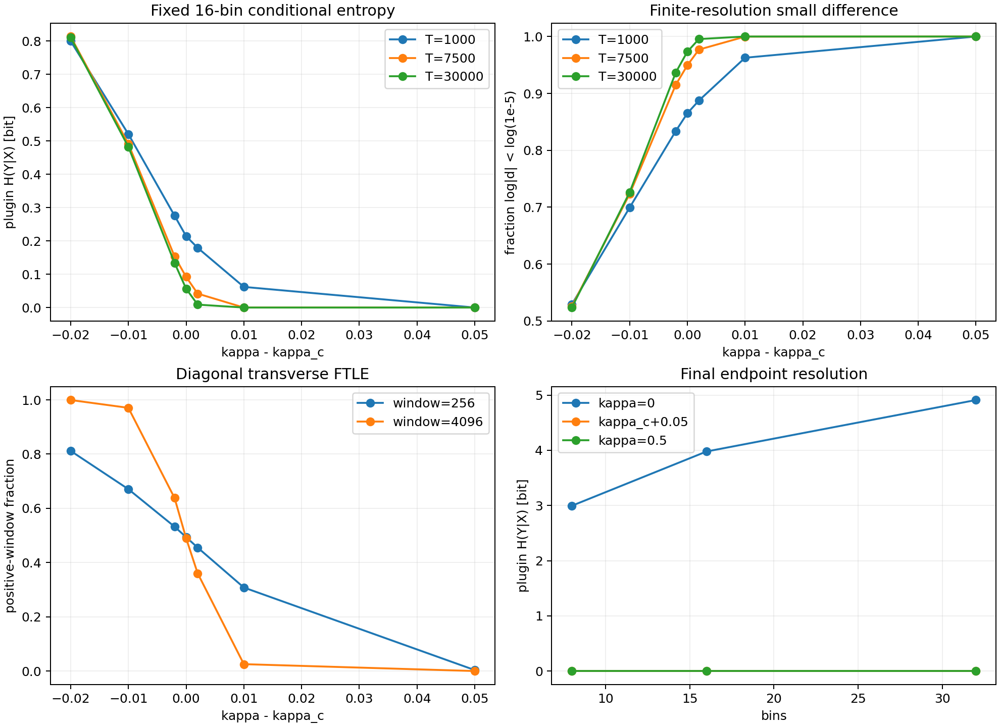

# E2F: 同期による情報縮約の条件付き証明と数値検証

理論監査・シミュレーション・独立再集計・考察を完了した。安定側の有限分解能で同時記述量の約半減を確認し、別途測った同期面の平均指数は正の理論値と整合した。一方、不安定側でも低い条件付きエントロピーが観測され、情報量だけによる安定同期判定は成立しない。実験設定は [README](README.md) と [config](config.json)。対象はE2Eと同じ出力混合tan二体系であり、旧E2加算結合には適用しない。

## 1. 主仮説の修正

「負の横Lyapunov指数ならエントロピーが減少する」という無条件の命題は採用しない。正しい構造は次の二段階である。

1. 同期面の横安定性は、同期面上で計算した横指数で解析できる。
2. 指定初期分布から差が確率収束し、量子化境界に周辺分布の質量が集中しなければ、固定分解能の条件付きエントロピーはゼロへ収束する。

第2段階の仮定を第1段階だけから導いてはいない。有限時間の単調減少、大域吸引、永久同期、熱力学的エントロピー減少、保存すべき入力の保持は別の主張である。

## 2. 定理：確率的同期から有限分解能の情報縮約へ

beta>1、$\gamma_*>0$ を $\gamma_*=\tanh(\beta\gamma_*)$ の解とし、独立な初期分布 $C(0,\gamma_*)^{\otimes2}$ から始める。非負の出力混合 $0\leq\kappa\leq1$ を用い、写像が未定義の零測度集合を除く。

各有限時刻の周辺分布は同じCauchy分布を保つ。この主張は、合成写像の各成分が上半平面の直積から上半平面への正則写像であることを用い、初期の積Poisson核に対し変数ごとに有界正則なCauchy変換を積分して得る。結合後のX,Yが独立だからではない。複素初期値 $(i\gamma_*,i\gamma_*)$ は固定されるため各周辺極も一定。任意の相関初期分布には拡張しない。詳細は [E2Eの証明要旨](../20260913_E2E_critical-slowing/RESULTS.md)。

固定座標

$$
U(x)=\frac12+\frac1\pi\arctan\frac{x}{\gamma_*},\qquad Q_B(x)=\lfloor B U(x)\rfloor
$$

を使う。理論上Uは(0,1)の一様分布となり、各周辺量子化エントロピーは常に $\log_2 B$ bitである。数値実装の端点丸めは最終ビンに処理する。

**命題。** $d_t=(X_t-Y_t)/2\to0$ が確率収束するなら、任意の固定整数B>=2に対し

$$
H(Q_B(Y_t)\mid Q_B(X_t))\longrightarrow0,
$$

$$
H(Q_B(X_t),Q_B(Y_t))\longrightarrow\log_2B,
\qquad I(Q_B(X_t);Q_B(Y_t))\longrightarrow\log_2B.
$$

**証明。** $|U'(x)|\leq1/(\pi\gamma_*)$ より、$|d_t|\leq a$ のとき $|U(X_t)-U(Y_t)|\leq2a/(\pi\gamma_*)$。この条件でビンが異なるには、U(X)がB-1個の内部境界のいずれかからその距離内になければならない。一様周辺分布と和集合上界から、不一致率 $p_t$ は

$$
p_t\leq\Pr(|d_t|>a)+\frac{4(B-1)a}{\pi\gamma_*}.
$$

まずtを無限大、次にaをゼロへ近づければ $p_t\to0$。XのビンをYのビンの予測値とする誤り指示変数Eを導入すると、E=0でYは確定し、E=1では高々B-1候補である。連鎖律から

$$
H(Q_B(Y_t)\mid Q_B(X_t))
\leq h_2(p_t)+p_t\log_2(B-1)\longrightarrow0.
$$

残りはエントロピーの連鎖律と固定周辺分布から従う。これはFano型上界をこの設定で直接証明したものである。各時刻の単調性は証明していない。

初期の独立性から同時エントロピーは $2\log_2B$。したがって上記仮定の下で極限は半分になる。一般の非同期・相関分布から常に半減するという主張ではない。量子化の細分化B->infinityとt->infinityの順序も交換していない。

## 3. 反例と区別

- Y=-Xでも、一方から他方が決定する。対称なビンでは反対角の条件付きエントロピーが0となるが完全同期ではない。同期誤差を併記する。
- 対角初期分布X=Yは不安定側でも厳密には不変であり、H(Y|X)=0。このため「条件付きエントロピー0なら横安定」は偽である。
- 共通軌道はカオス的に変動できるので、条件付きエントロピー0は周辺エントロピー0を意味しない。
- 同期した同時分布は二次元Lebesgue密度を持たず、二次元微分エントロピーを通常通り定義できない。ここで測るbit量と混同しない。
- 一時刻のH(Y|X)は時間的エントロピー率ではない。実符号長と入力復号も測っていない。

## 4. Lyapunov理論

同期面の共通軌道は $s'=\tan(\beta s)$、横変分は $d'=(1-2\kappa)f'(s)d$。不変Cauchy測度に関する積分指数は

$$
\lambda_0=\log\beta+2\log(1+\gamma_*),\qquad
\lambda_\perp=\lambda_0+\log|1-2\kappa|.
$$

理由は $f'(s)=\beta(1+f(s)^2)$ と、不変性および $\mathbb E\log(1+X^2)=2\log(1+\gamma_*)$。典型的な単一軌道の長時間極限と同一視するにはエルゴード性等を確認する必要がある。今回の独立定常初期アンサンブル平均とは区別する。

下側境界 $\kappa_c=(1-e^{-\lambda_0})/2$ 近傍では、$\delta=\kappa-\kappa_c$ に対し

$$
\lambda_\perp=-2e^{\lambda_0}\delta+O(\delta^2).
$$

平均ドリフトだけの時間尺度は $|\lambda_\perp|^{-1}$。E2Eで得た有限窓の最終離脱時間の傾き約-1.53は別の観測量であり、ここから普遍指数や滞在時間分布の-3/2則を主張しない。

### 追加で導ける有限時間の面積伸長の恒等式

実際の二体系のJacobianは

$$
J(x,y)=\begin{pmatrix}(1-\kappa)f'(x)&\kappa f'(y)\\
\kappa f'(x)&(1-\kappa)f'(y)\end{pmatrix},\qquad
\det J=(1-2\kappa)f'(x)f'(y).
$$

したがって $\kappa\ne1/2$、上記初期分布・周辺閉包の下で、任意の有限Tに対して

$$
\mathbb E\left[\frac1T\log|\det D F^T(X_0,Y_0)|\right]
=\log|1-2\kappa|+2\lambda_0.
$$

証明はlogdetの時間和と各時刻の周辺分布を使うだけで、X,Y間の独立性も同時分布の定常性も不要である。対数導関数はCauchy周辺で可積分。一方、この式を各軌道の無限時間Lyapunov指数和と読む場合は、適切な不変測度・積分可能性・エルゴード性等の条件が別途必要。

同期面上では $\lambda_\parallel+\lambda_\perp$ が正でも $\lambda_\perp<0$ になり得る。したがって、同期による情報縮約を「Jacobianの平均体積収縮が負になること」で定義してはいけない。この恒等式の全スペクトルによる数値検証は今回の測定範囲に含めない。

### KSエントロピー

対角埋め込み $s\mapsto(s,s)$ により、対応する不変測度上の一体系と同期面の力学は同型なので、両者のKSエントロピーは等しい。独立な非結合二体系では積測度に関するKSエントロピーは加算される。

しかし、非同期アトラクタのKSエントロピーを、同期面上の $\lambda_0+\max(0,\lambda_\perp)$ で代用しない。正のLyapunov指数和との同一視にはPesin公式の適用条件があり、極を持つtan写像についてここでその条件を証明していない。[Pesin (1977), 原論文](https://www.mathnet.ru/eng/rm3219)。今回の図のLyapunov値はKSエントロピーの実測ではない。

## 5. 理論監査の記録

独立担当がE2Eの理論記録とCauchy周辺閉包ノートを照合し、本稿の量子化境界の定数、Fano型上界、有限時間logdet恒等式、KSの測度同型、符号を捨てた積分器の交換対称集計を確認した。重大な数式上の不整合は見つからなかった。これは大域的な確率同期の証明を追加したという意味ではない。

持続する独立ノイズを二体系に加えると、差分にも差分ノイズが入り、通常は $d_t\to0$ という本命題の仮定が成立しない。ノイズ床の情報量は別に解析する必要がある。今回の測定は無外乱の数値力学であり、丸め誤差・線形化誤差への限定的な検査を行う。

## 6. 数値結果・考察

### 6.1 実行規模と結論

主実験9結合×独立4バッチ×4096ペア、感度実験2結合×3切替条件×独立2バッチ×2048ペアを、それぞれ30,000更新まで実行した。独立初期ペアは主16,384・感度4096で、結合・切替条件間では同じペアを共有する。延べ172,032ペア条件、5,160,960,000更新、860,160 snapshot記録。別途、同期面の256独立初期値を32,768更新した。無効snapshotは主・感度とも0。計算時間は本runで98.94秒（Python3.12.10、Numba0.66.0、16 threads、fastmath=False）。

**有限設定の主仮説は支持された。** 安定側 kc+0.05 の T=30000 では、8/16/32ビンのすべてで標本条件付きエントロピー0、小差分率1となり、事前の25%/95%基準を満たした。別途、独立した同期面アンサンブルで測定した共通方向の平均指数1.19424817は理論1.19423272と差0.00001545で整合し、正だった。実際の二体系の全指数を測定したものではない。ただし、条件付き確率収束定理の大域的仮定や母エントロピーの厳密なゼロは、この有限標本から証明していない。

情報量と小差分率は独立4バッチ平均。左下は256同期面軌道の平均。左上・右上は16ビンの条件付きエントロピーと対数差分による小差分率、左下は独立の同期面軌道で測った横指数の正値窓率、右下は非結合・安定側・一歩同期対照の分解能比較。点間の線は視認用で、未測定結合の推定やフィットではない。左上の三曲線を臨界指数とは解釈しない。右下では安定側と一歩同期対照が重なる。

### 6.2 情報量の縮約

16ビン、T=30000。エントロピーの±は独立4バッチの標準偏差であり、95%信頼区間ではない。小差分は $|d|<10^{-5}$。再離脱は、初期時刻から観測終了までに一度この閾値内に入り、その後に外へ出た**全初期ペアに対する割合**である。末尾の安定性や入域者条件付き割合とは異なる。

| 結合 | H(X) bit | H(X,Y) bit | H(Y\|X) bit | 小差分率 | 過去に再離脱した率 |
|---|---:|---:|---:|---:|---:|
| 非結合0 | 3.99882 | 7.97684 | 3.97802 ± 0.00190 | 0.00000 | 0.10242 |
| kc-0.02 | 3.99780 | 4.80801 | 0.81021 ± 0.03678 | 0.52374 | 1.00000 |
| kc-0.01 | 3.99773 | 4.47967 | 0.48193 ± 0.01986 | 0.72607 | 1.00000 |
| kc-0.002 | 3.99793 | 4.13177 | 0.13384 ± 0.00938 | 0.93683 | 0.99774 |
| kc | 3.99756 | 4.05414 | 0.05658 ± 0.01374 | 0.97327 | 0.98938 |
| kc+0.002 | 3.99711 | 4.00591 | 0.00879 ± 0.00849 | 0.99554 | 0.96802 |
| kc+0.01 | 3.99743 | 3.99743 | 0 | 1.00000 | 0.86841 |
| kc+0.05 | 3.99816 | 3.99816 | 0 | 1.00000 | 0.48871 |
| 一歩同期0.5 | 3.99708 | 3.99708 | 0 | 1.00000 | 0.00000 |

周辺の約4bitは残り、安定側では同時記述の約8bitが約4bitになる。これは共通のカオス的変動を消すことなく、二重に記述していた状態情報が重複するという解釈と整合する。16ビンの相互情報量は安定側kc+0.05で3.99816bit。

他の分解能でも、非結合→kc+0.05の条件付きエントロピーは8ビンで2.99437→0bit、32ビンで4.91021→0bit。安定側の周辺エントロピーはそれぞれ2.99897/4.99508bitだった。

ただし、標本0は母集団の厳密な0ではない。kc+0.05のバッチ別中央値を平均したlog|d|は約-12026.57で、差分は対数座標で保持されている。状態を通常のfloatへ復元すると差が表示できず同じビンになるが、これを厳密なd=0や永久同期と呼ばない。κ=0.5の一歩同期は数学的に異なる対照である。

### 6.3 臨界状態と仮説の限界

beta=1.2でkc=0.3485318487。下表は16ビンの有限時間比較である。

| delta | H(Y\|X), T7500→30000 bit | 小差分率, T7500→30000 | 同期面の正値FTLE窓率, 256/4096更新 |
|---|---:|---:|---:|
| -0.002 | 0.15330 → 0.13384 | 0.91528 → 0.93683 | 0.53244 / 0.63818 |
| 0 | 0.09194 → 0.05658 | 0.94934 → 0.97327 | 0.49390 / 0.48975 |
| +0.002 | 0.04177 → 0.00879 | 0.97699 → 0.99554 | 0.45523 / 0.36035 |

臨界点のすぐ安定側でも、256更新窓の約45.5%、4096更新窓の約36.0%で横指数が正となった。長時間平均が負でも、有限窓の増幅が残る。delta=+0.01では正値率が約30.8%/2.54%へ、+0.05では約0.354%/0%へ下がる。窓は各軌道内の非重複区間で、独立な反復として信頼区間を作ってはいない。

**重要な反証的観察:** 横方向が局所不安定なdelta=-0.002でも、T30000の条件付きエントロピーは0.13384bit、小差分率は93.68%だった。それでも99.77%のペアが過去に再離脱している。さらにdelta=-0.01でも条件付きエントロピーは0.48193bitに低下する。このため、情報量の小ささや一時刻の高い小差分率を、負の横指数・安定同期の代用にすることはできない。

安定側kc+0.05の再離脱率48.87%は過渡期を含む履歴であり、T30000時点の小差分率100%と矛盾しない。逆に、ある末尾時刻で全ペアが小差分でも永久同期は証明できない。非結合でも稀な接近と離脱は起こるため、そこで10.24%の再離脱履歴があることも同期機構の存在を意味しない。

この結果は、平均横指数だけでなく、その揺らぎと有限距離の再離脱を調べる必要性を支持する。しかし、FTLEは独立の同期面アンサンブル、再離脱は有限差分アンサンブルで測っており、各バーストとの時間対応を解析していない。「揺らぎが縮約時間を支配する」という因果的・定量的な主張まで検証したとは言わない。on-off intermittencyの分布則、blowoutの分岐分類、普遍的臨界指数の確定は未実施である。

### 6.4 統計と数値精度

主条件全45snapshot条件で、周辺エントロピーのlog2Bからの差は、8ビン0.00052～0.00185bit、16ビン0.00111～0.00336bit、32ビン0.00229～0.00659bitだった。固定Cauchy周辺と整合的な有限標本の結果だが、分布同一性の完全な検定ではない。

シャッフル対照でも相互情報量が正に推定される。主条件の範囲は、8ビン0.00380～0.00621bit、16ビン0.01870～0.02422bit、32ビン0.08545～0.09605bit。特に32ビンは同時セルが1024あり、バッチ4096ペアでは有限標本偏りが無視できない。対照値を機械的に減算せず、元の推定値と併記した。対称化で各ペアから2方向へ半分ずつ重みを加えるが、独立標本数を2倍とは数えない。

切替etaの感度は、独立2バッチ×2048ペアの同じ初期値を3設定で共有して測った。T30000・16ビンの結果：

| delta | eta | H(Y\|X) bit | 小差分率 |
|---|---:|---:|---:|
| -0.01 | 1e-4 | 0.46651 | 0.72339 |
| -0.01 | 1e-6 | 0.46906 | 0.73535 |
| -0.01 | 1e-8 | 0.41646 | 0.72388 |
| +0.002 | 1e-4 | 0.00919 | 0.99487 |
| +0.002 | 1e-6 | 0.00232 | 0.99341 |
| +0.002 | 1e-8 | 0.00459 | 0.99585 |

eta間の幅は、不安定側でH(Y|X)0.05259bit・小差分率1.196ポイント、安定側で0.00687bit・0.244ポイント。同程度の傾向は保つが、2バッチであり、etaに対する単調収束も見られない。数値精度の収束・統計的同等性は未確立とする。高精度の長期軌道一致や、全スペクトルの独立計算をこの感度比較で代用しない。

正確な一歩同期k=0.5ではmedian_logd=-infinityとなるため、そのバッチ標準偏差は未定義でCSVのNaNが正しい。これは無効軌道や失敗した情報量計算ではない。警告を隠すために計算データを変更していない。

## 7. 検証・再現と構造

- 既存E2Eテスト：6件通過（極近傍の80桁参照比較、線形化境界、零差分など）。
- E2F preflight：既知分布の条件付きエントロピー・連鎖律・Fano、一歩同期、underflow以下の対数差分、結合格子、4ペアの計算→集計までの13チェックが通過。
- 開発中に再離脱配列の引数位置が誤っているTypeErrorを再現し、関数定義を修正して上記の経路テストを追加した。失敗した計算から結果は保存されておらず、修正後のコード・設定を再固定して本runを実施した。
- 保存検証：主540+感度180の全720度数・指標行、全225集計行、代表30ペア条件軌道の再生とファイルハッシュを照合した。これは同一実装による整合性・再現性確認で、独立した数値解法ではない。
- 独立レビュー：実験スクリプトをimportせず、NumPy histogram2dと直接の $-\sum p\log_2(p/p_X)$ 等で全720同時度数を再構成した。保存度数は完全一致、条件付きエントロピー・相互情報量・周辺エントロピー等の最大差は2.86e-15。全225集計行の平均・標準偏差6750項目の最大差は4.55e-13、シャッフルMI720件の最大差は3.36e-15。全Fano上界と入域・再離脱履歴の単調性・整合性も確認。同期面の2軌道について $\log\beta-2\log|\cos(\beta s)|$ から独立に平均指数を計算し、保存値との差は最大1.40e-14。
- 図は表示を確認し、文字切れや情報の欠落がないことを確認した。

[集計CSV](artifacts/aggregate_metrics.csv)、[バッチ別CSV](artifacts/batch_metrics.csv)、[機械可読結果](artifacts/metrics.json)、[事前検証](artifacts/preflight.json)、[保存検証](validation.json)、[設定](config.json)、[実行環境](artifacts/environment.json)、[SHA-256台帳](artifacts/hash_manifest.json)を保存した。初期値・snapshot・度数・FTLEは同じartifacts内のNPZに残す。

コードは [entropy_sync.py](entropy_sync.py) の1ファイルを追加し、E2Eの積分器を再利用した。新規テストファイルは作らずpreflightを1検証単位として用いた。独立した科学的問い・生成データのためにE2F runとそのartifactsを作成し、既存run・原資料・他の未コミット変更は保持した。恒久的な共通モジュールや新しい依存ライブラリは追加していない。

## 8. 今回の到達点と次に区別すべき問い

1. **理論で確認できたこと：** 確率的同期と固定周辺分布という仮定の下で、固定分解能の条件付きエントロピーが0へ収束する。有限時間logdetのアンサンブル恒等式も導ける。
2. **数値で支持されたこと：** 指定した安定側・観測時間・分解能の二体系では同時記述量がほぼ半減した。別途、同期面アンサンブルの平均指数は正の理論値と整合した。
3. **修正が必要だった解釈：** 条件付きエントロピーが小さいことは安定同期の十分条件ではない。局所不安定側にも強い情報依存と再離脱が共存する。
4. **未確定：** 負の横指数から大域的な確率同期への証明、実際の不変測度の全スペクトル・KSエントロピー、再離脱とFTLEの同一軌道上の時間対応、普遍臨界指数、入力保持・復号・実符号長。

したがって仮説は「局所横安定性と、有限分解能の情報縮約は関連するが同一ではない。同期が確率的に成立すれば情報縮約は定理として従い、臨界付近では有限時間の接近・離脱を別に観測する必要がある」と改訂する。
